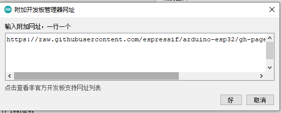
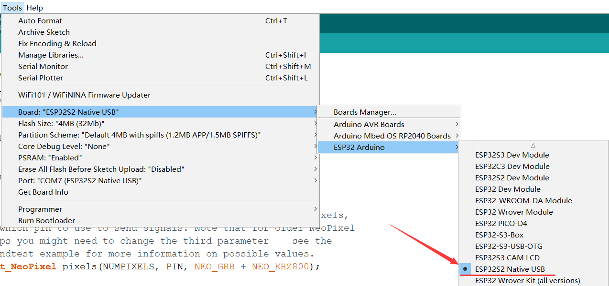

# 环境搭建

> 参考[arduino-esp32 DOC Getting Started » Installing](https://docs.espressif.com/projects/arduino-esp32/en/latest/installing.html)

## 使用Arduino IDE安装支持

这是直接从 Arduino IDE 安装 Arduino-ESP32 的方法。

> 从 Arduino IDE 版本 1.6.4 开始，Arduino 允许使用 Boards Manager（开发板管理器）安装第三方平台包。有适用于 Windows、macOS 和 Linux 的软件包。

Arduino IDE 下载地址：https://www.arduino.cc/en/software

> Arduino IDE 2.0与Arduino IDE 1.8.x的UI有些许差异，本文基于1.8.13版本编写，但不影响使用2.0版本的用户参考。

要使用 Boards Managaer（开发板管理器）安装esp32平台包，请执行以下步骤：

- 安装当前上游 Arduino IDE 1.8 或更高版本。

- 启动 Arduino 并打开 File（文件）> Preferences（首选项）窗口，找到Additional Board Manager URLs（附加开发板管理器网址）。


- 稳定版链接：
```
https://raw.githubusercontent.com/espressif/arduino-esp32/gh-pages/package_esp32_index.json
```
- 开发版链接：
```
https://raw.githubusercontent.com/espressif/arduino-esp32/gh-pages/package_esp32_dev_index.json
```
- 在Additional Board Manager URLs后面输入上述发布链接之一。您可以添加多个 URL，一行一个。



从菜单打开 Tools（工具） > Board（开发板）> Board Manager（开发板管理器） 搜索并安装esp32平台。


重启arduino IDE之后可以看到在开发板选项中多了ESP32 Arduino选项。

选择 `ESP32S2 Native USB` 这个型号，再参照下图所示的内容进行配置一遍即可，配置不当是无法使用的，请一定要参照下图所示的内容进行配置！


