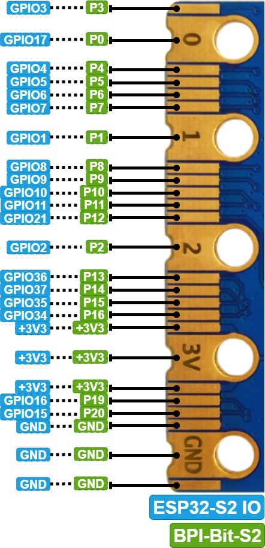

# 【 开发板介绍 】

BPI-Bit-S2 development board is a successor to BPI-Bit, inheriting most of the hardware functions.

IO is compatible with micro:bit and can use most peripheral accessories of micro:bit.

Support Webduino, Arduino, MicroPython & CircuitPython programming environment suitable for STEAM education.

## Key features

* ESP32-S2
* 5x5 RGB LED matrix
* 1 buzzer
* 1 thermistor sensor
* 2 photosensitive sensors
* 2 programmable keys,1 BOOT key,1 Reset key
* Type-C USB interface
* Size 5x5cm
* The Goldfinger Edge Connector definition is fully compatible with Micro: Bit

## Hardware

### Diagram

### Hardware Specifications

| Features              | Specs                                                                              |
|-----------------------|------------------------------------------------------------------------------------|
| MCU                   | ESP32-S2FN4R2，Xtensa® 32 bit LX7 Single-Core Processer                            |
| Frequency             | 240MHz MAX                                                                         |
| operating temperature | -40℃~+85℃                                                                          |
| ROM                   | 128 KB                                                                             |
| SRAM                  | 320 KB                                                                             |
| FLASH ROM             | 4 MB                                                                               |
| PSRAM                 | 2 MB                                                                               |
| WIFI                  | IEEE 802.11 b/g/n ，2.4Ghz                                                         |
| GPIO                  | 19 available GPIO pins have been introduced                                        |
| Peripheral functions  | ADC,TOUCH,PWM,SPI,I2C,I2S,Pulse counter, RMT,TWAI® Controller,SD/MMC,LCD_CAMERA    |
| External crystal      | 40Mhz                                                                              |
| Buzzer                | 8.5x8.5mm buzzer                                                                   |
| LED                   | 25 WS2812 rgb LED, single line GPIO control; 1 monochrome LED, controlled by GPIO0 |
| Photosensitive sensor | 2 photosensitive sensor                                                            |
| Thermistor sensor     | 1 thermistor sensor                                                                |
| IO                    | 19 pins Goldfinger IO,19 pins contacts on the back                                 |
| Key                   | 2 programmable keys,1 BOOT key,1 Reset key                                         |
| USB                   | USB Type-C interface，full speed USB OTG,USB-ACM                                   |
| Operating voltage     | 3.3V                                                                               |
| Power                 | USB Type-C input 5V，or Goldfinger IO input 3.3V power supply                      |
| Size                  | 5 * 5 cm                                                                           |

### On-board peripherals

|    On-board peripherals   | GPIO |     Signal type        |
|:-------------:|:--------:|:-------------------:|
| Photosensitive sensor(L) | GPIO 12  | Analog Input        |
| Photosensitive sensor(R) | GPIO 13  | Analog Input        |
| Key A        | GPIO 38  | Digital Input       |
| Key B        | GPIO 33  | Digital Input       |
| Key BOOT     | GPIO 0   | Digital Input       |
| Thermistor sensor    | GPIO 14  | Analog Input        |
| Buzzer        | GPIO 17  | PWM(Digital Output) |
| RGB_LED       | GPIO 18  | Digital Output      |

### 5*5 RGB LED

BPI-Bit-S2 have 25 WS2812 full color RGB LED, single GPIO ontrol.

The three primary color pixels of each LED can achieve 8bit 256 level brightness display,

and achieve 16777216 color full color display,

scanning frequency is not less than 400Hz/s.

|   |    |    |   |   |
|:--:|:--:|:--:|:-:|:-:|
| 20 | 15 | 10 | 5 | 0 |
| 21 | 16 | 11 | 6 | 1 |
| 22 | 17 | 12 | 7 | 2 |
| 23 | 18 | 13 | 8 | 3 |
| 24 | 19 | 14 | 9 | 4 |

### Goldfinger GPIO define

### SPI and I2C preset pins

| Function | Pin Name | GPIO Num |
|----------|----------|----------|
| SPI_SCK  | P13      | GPIO36   |
| SPI_MISO | P14      | GPIO37   |
| SPI_MOSI | P15      | GPIO35   |
| SPI_CS   | P16      | GPIO34   |
| I2C_SCL  | P19      | GPIO16   |
| I2C_SDA  | P20      | GPIO15   |

### Power

BPI-Bit-S2 supports two power supply modes

1. Type-C USB：Use USB cable power supply, connect USB interface of computer or other 5V USB charger to power the development board.

2. Gold finger: At the bottom of the development board, the gold finger contains a power interface with both input and output functions. It uses 3.3V power supply, positive terminal is connected to 3V3, and negative terminal is connected to GND.

## Resources

- [GitHub: BPI-BPI-Bit-S2 Development Board Schematic PDF](https://github.com/BPI-STEAM/BPI-BIT-Lite-Doc/blob/main/sch/BPI-BIT-Lite- V0.2.pdf)