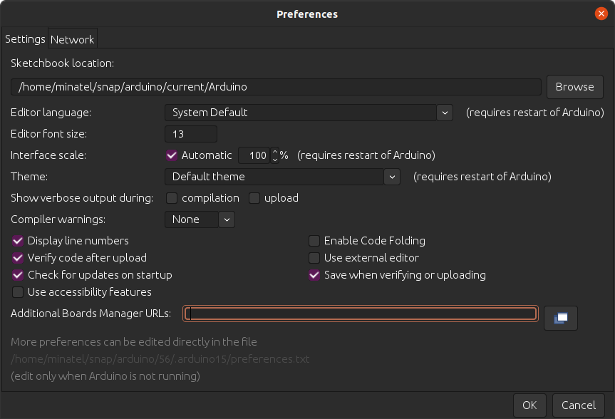
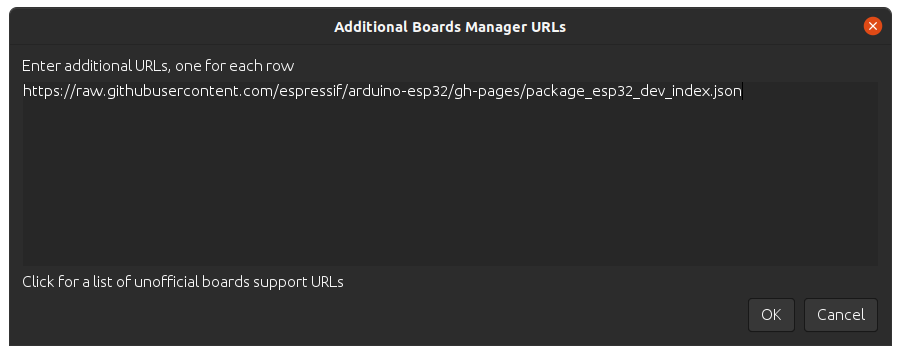
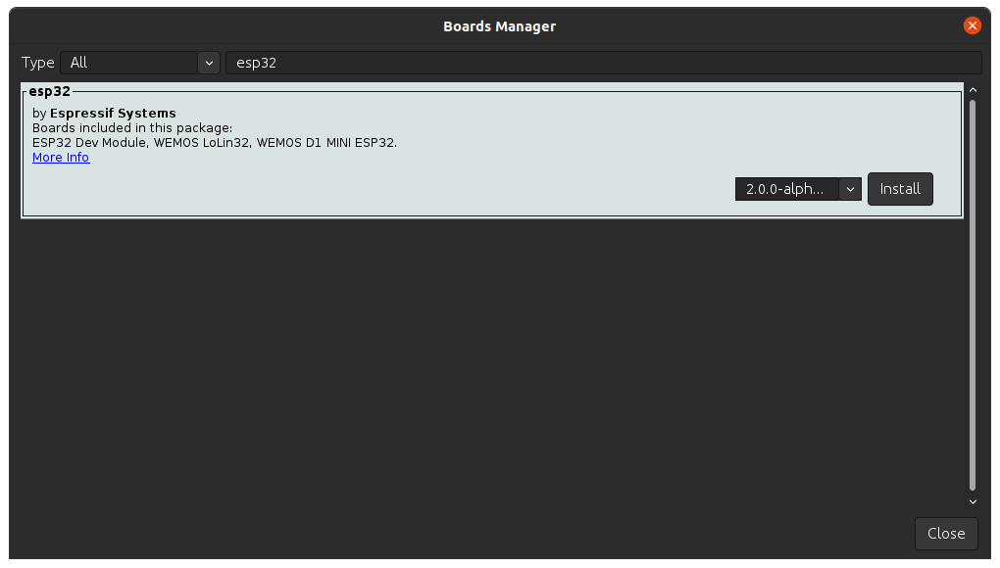

## Install and configure the environment

> Reference [arduino-esp32 DOC Getting Started » Installing](https://docs.espressif.com/projects/arduino-esp32/en/latest/installing.html)

This is the way to install Arduino-ESP32 directly from the Arduino IDE.

- Stable version link: https://espressif.github.io/arduino-esp32/package_esp32_index.json

- Development version link: https://espressif.github.io/arduino-esp32/package_esp32_dev_index.json

> Starting with the Arduino IDE version 1.6.4, Arduino allows installation of third-party platform packages using Boards Manager. We have packages available for Windows, macOS, and Linux.

To start the installation process with Boards Managaer, follow these steps:

- Install the current upstream Arduino IDE at the 1.8 level or later. The current version is at the [arduino.cc website](https://www.arduino.cc/en/software).

- Start Arduino and open the File>Preferences window.

- Enter one of the release links above into **Additional Board Manager URLs** field. You can add multiple URLs, separating them with commas.

Open the Board Manager from the Tools > Boards menu and install the esp32 platform.

- Restart Arduino IDE.

- Select `ESP32S3 Dev Module` board from Tools > Board menu after installation.

- Select the correct settings in the Tools menu as shown below.

| Setting                  | Value                            |
| :----------------------- | :------------------------------- |
| USB CDC On Boot          | Enabled                          |
| CPU Frequency            | 240MHz (WiFi)                    |
| Core Debug Level         | None                             |
| USB DFU On Boot          | Enabled (Requires USB-OTG Mode)  |
| Erase All Flash Before Sketch Upload | Disabled             |
| Events Run On            | Core 1                           |
| Flash Mode               | QIO 80MHz                        |
| Flash Size               | 8MB (64Mb)                       |
| JTAG Adapter             | Integrated USB JTAG              |
| Arduino Runs On          | Core 1                           |
| USB Firmware MSC On Boot | Disabled                         |
| Partition Scheme         | 8M with spiffs (3MB APP/1.5MB SPIFFS) |
| PSRAM                    | QSPI PSRAM                       |
| Upload Mode              | UARTO / Hardware CDC             |
| Upload Speed             | 921600                           |
| USB Mode                 | Hardware CDC and JTAG            |

- Or select `BPI-Leaf-S3` board from Tools > Board menu, its default settings can be used directly.