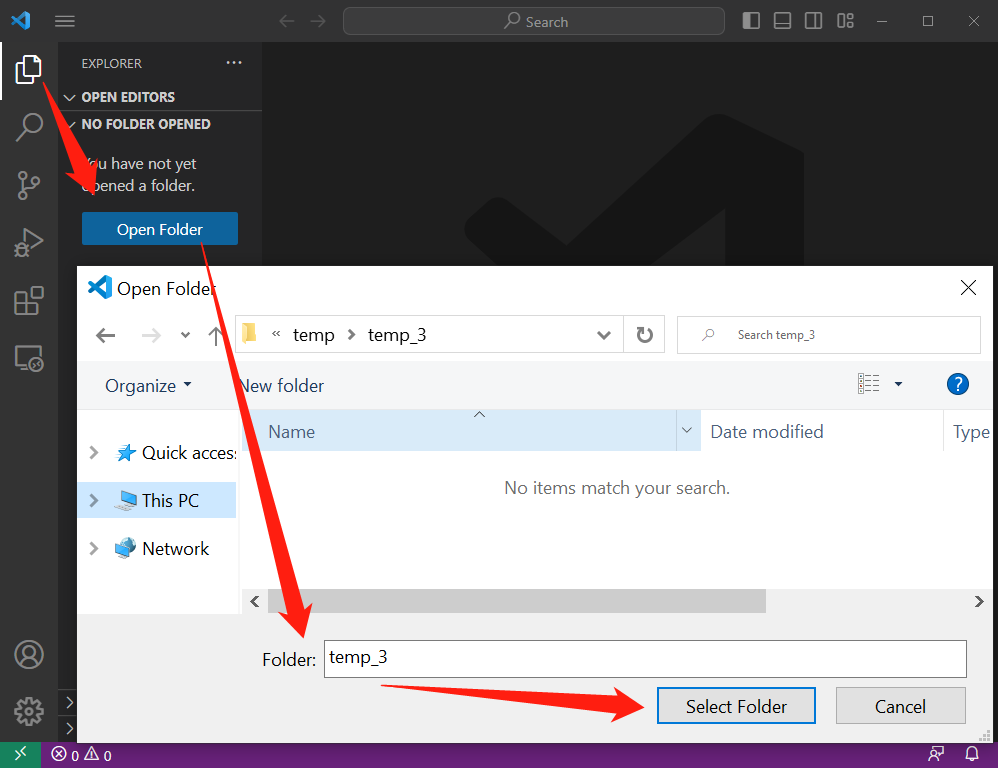
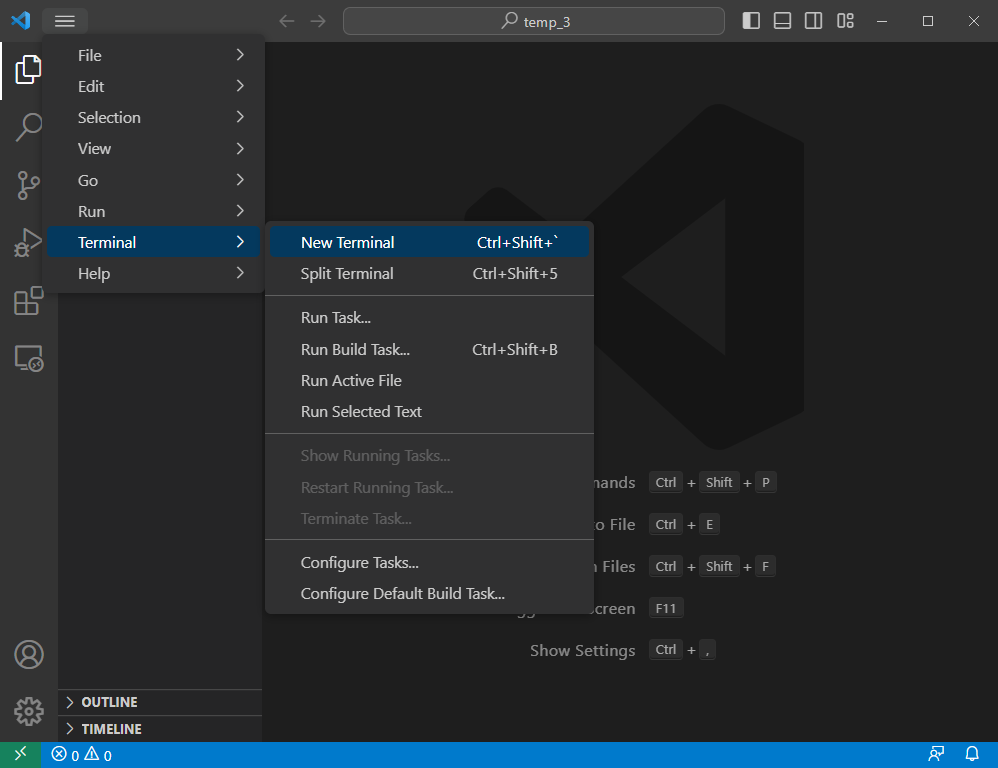
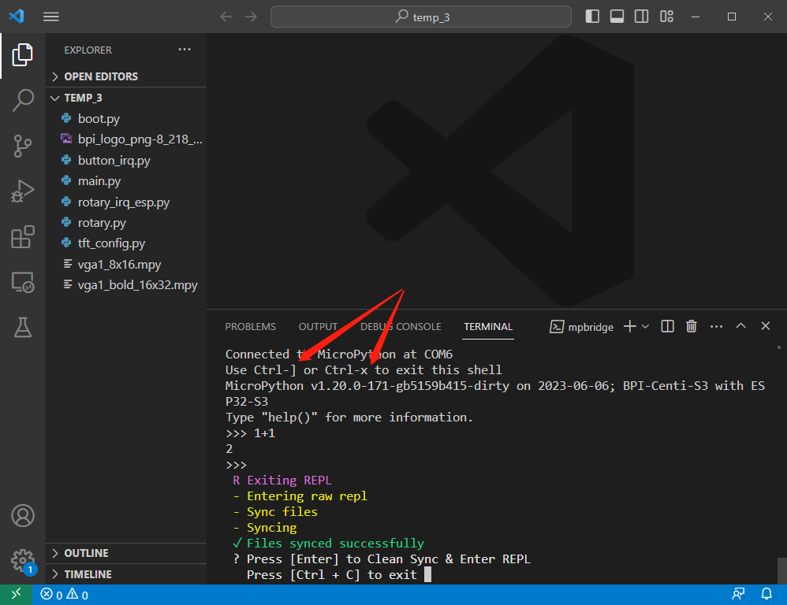
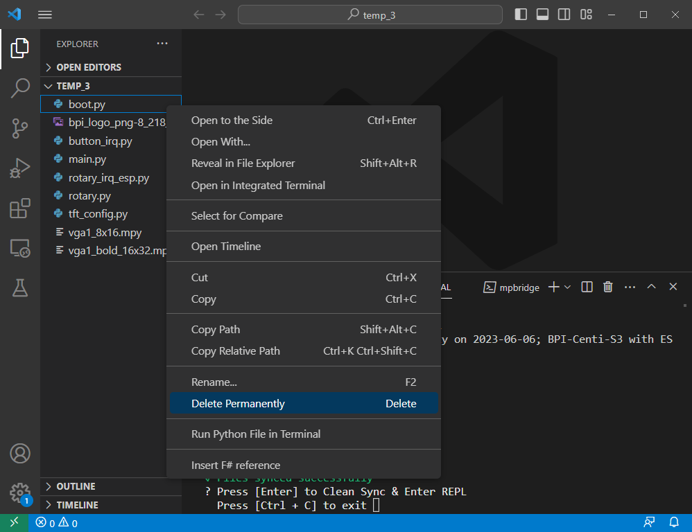
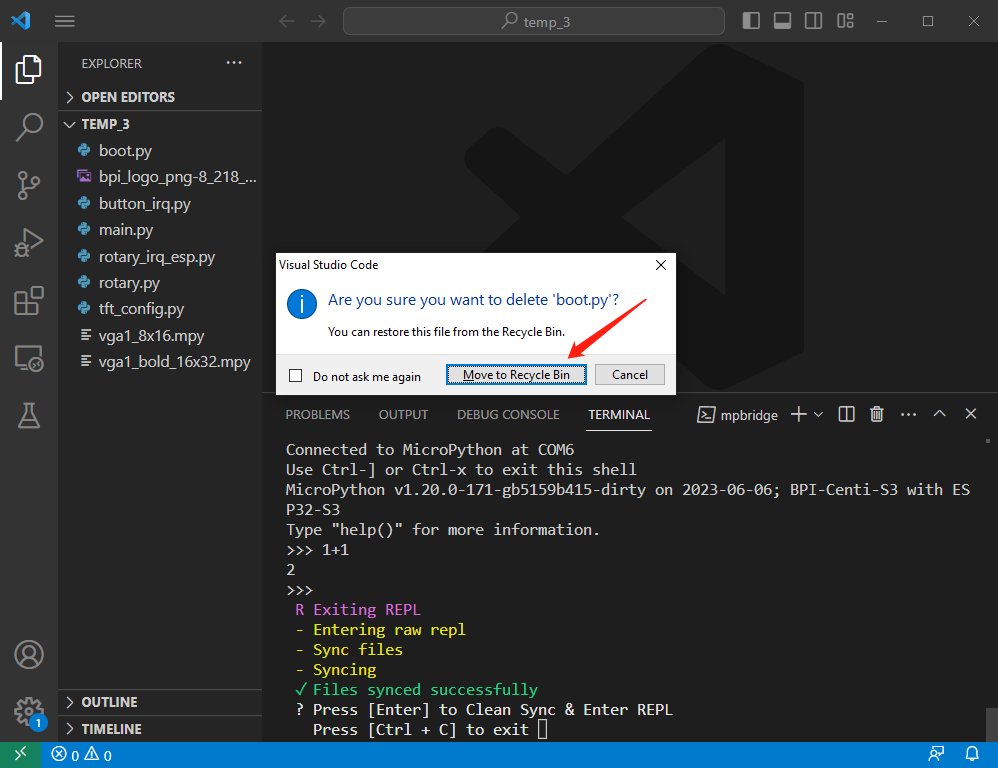
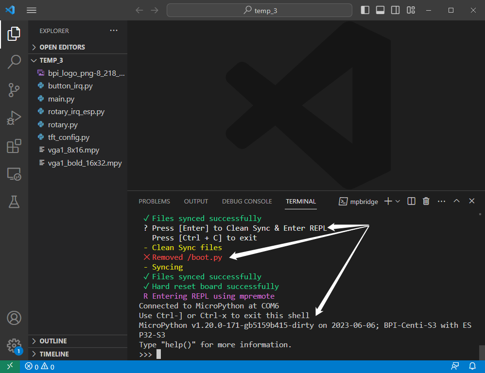

## How to use VScode + mpbridge tool

> [Install Visual Studio Code](./environment.html#install-visual-studio-code), [Install the mpbridge tool](./environment.html#install-the-mpbridge-tool) needs to be done first.

### Python Extensions

Search `python` in the extension item to install Python extension support.


### Open folder

Click `Open Folder` in the file explorer item to open a folder, or create a new blank folder.

It is especially recommended for novices to start with a blank folder.



### open terminal

Click the `Terminal` item, click the `New Terminal` item, and a new terminal window will open, which usually appears in the lower box.



### mpbridge list serial port numbers

First make sure your MicroPython development board has a serial data connection to your computer.

Enter the following command in the terminal and hit enter, and all serial port numbers on the computer will be listed.
```sh
mpbridge list
```


If there is only one serial device connected to your computer, and it is your MicroPython development board, then the serial port number is that of the development board.

If your computer is connected to multiple serial devices, you can check the number list once by connecting the device, and check the number list once by unplugging the device to find the only item that changes, which is the serial number of your MicroPython development board. port number.

### mpbridge connects to the development board

Enter the following command in the terminal, modify the serial port number at the end to the number determined in the previous step, and hit the Enter key. If you are currently opening a blank folder, the mpbridge tool will first copy the files on the MicroPython development board to this folder.
```sh
mpbridge dev --auto-reset hard COM6
```


When the files are copied, the terminal will display:
```
  ? Press [Enter] to Clean Sync & Enter REPL
    Press [Ctrl + C] to exit
```

To enter the REPL, hit the Enter key again, and to exit the tool, use the `Ctrl + C` shortcut.

Before entering the REPL, the development board will be hard reset once, so that the program results can be viewed immediately.

If you don't want a hard reset, use this command:
```sh
mpbridge dev COM6
```

If you want to use soft reset then:
```sh
mpbridge --auto-reset soft COM6
```


Once you are in the REPL, you can exit the REPL at any time by simply using the `Ctrl + X` shortcut.



### Modify or add new files

If you modify the code in a file or add a file in the local folder before exiting the REPL, the mpbridge tool will automatically check the changed file and synchronize it to the development board.

```sh
mpbridge dev --auto-reset hard COM6
```

This is also done when starting the command in the terminal.


### Delete Files

```sh
mpbridge dev --auto-reset hard COM6
```

When this command finishes syncing the files, the terminal will display:
```
  ? Press [Enter] to Clean Sync & Enter REPL
    Press [Ctrl + C] to exit
```

If you need to delete one or more files, delete it in the local folder first. Then click the Enter key, the mpbridge tool will automatically execute `Clean Sync`, delete the file with the same name in the development board, and finally enter the REPL.







If you only want to temporarily delete the files on the development board and need to keep the files locally on the computer, please remember to back up the files to other folders in advance.

### What did mpbridge do?

```sh
mpbridge dev --auto-reset hard COM6
```

When starting to run this command, and after exiting the REPL, mpbridge will automatically perform these file operations:

1. Push the files that are not in the device but exist locally to the device.
2. Check the hash of the files both in the local and the device, and then push the different files from the local to the device.
3. Pull the files that are not in the local but exist in the device to the local.


Whenever the terminal displays this prompt:
```
  ? Press [Enter] to Clean Sync & Enter REPL
    Press [Ctrl + C] to exit
```

Press the Enter key again, and mpbridge will automatically perform these file operations:

1. Push the files that are not in the device but exist locally to the device.
2. Check the hash of the files both in the local and the device, and then push the different files from the local to the device.
3. Delete the files from the device that are not in the local but exist in the device.
4. Hard reset the device and enter REPL.

If you press the `Ctrl + C` shortcut key at this time, you will exit the mpbridge tool.
