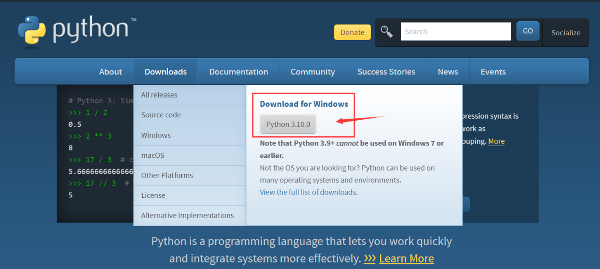

## Configure the development environment

### System Environment Requirements

Supports development in Windows 10, Windows 11, MacOS, Ubuntu or other Linux desktop operating systems.

All the application examples in this article are based on the Windows 10 operating system, and other operating systems can also be used for reference.


### Install the Python environment

Open [Python official website](https://www.python.org/).

For the Windows system, the most convenient way to download the installation package is to click the icon shown in the figure below on the homepage of the official website to download.



Other operating systems or other distributions can be selected in the Downloads option bar.

It is recommended to use a version above python 3.7.

Be sure to check Add Python 3.x to PATH when you start the installation, so that you can avoid adding it to PATH manually.


Follow the installation prompts step by step to complete the installation smoothly.

### Install the mpremote tool

The MicroPython open source community has launched a development aid tool: mpremote, through which we can establish serial communication with the development board, use REPL, and manage the file system on the development board. It also has mount and mip functions, which will be described in detail in subsequent chapters (preparing).

After installing the Python environment, you can use pip to install mpremote in the terminal.

Open PowerShell in the Windows system, and open the corresponding terminal in other operating systems, and enter the following command to install mpremote.

```
pip install mpremote
```

### Install the mpbridge tool

mpbridge is a CLI tool developed based on mpremote. It mainly provides the function of automatically synchronizing files to improve development efficiency.

Enter the following command in Terminal to install mpbridge.

```
pip install mpbridge
```

### Install Visual Studio Code

The use of MicroPython does not depend on specific development tools, as long as the serial port communication with the development board can be established, the MicroPython interactive interpreter (REPL) can be obtained.

Purely speaking, we basically only need a text editor to edit the code, and then upload our .py script files or other files to the development board through the mpremote tool or mpbridge tool.

For a specific editor that combines basic code completion, syntax highlighting, integrated terminal, and lightweight, multi-platform adaptation requirements, I recommend using Visual Studio Code (VScode), which may already be the tool you are most familiar with one of them.

[Visual Studio Code official website address](https://code.visualstudio.com/)

VScode documentation that may need to be referred to:
* [Visual Studio Code Official Documentation](https://code.visualstudio.com/docs)
     * [Basic installation, setup](https://code.visualstudio.com/docs/setup/setup-overview)
     * [Set Display Language](https://code.visualstudio.com/docs/getstarted/locales)
     * [Use the integrated terminal](https://code.visualstudio.com/docs/terminal/basics)


All in Web people, minimalists, try [VScode on the Web](https://vscode.dev/), open a terminal on the local operating system and use mpremote or mpbridge to synchronize files, MicroPython REPL.

### Other recommended editors
* [PyCharm Community Edition](https://www.jetbrains.com/pycharm/download/#section=windows), the free community edition is sufficient, and it also has code completion for micropython special libraries, although incomplete and It hasn't been updated for a long time.
* [Jupyter](https://jupyter.org/) is also an editor on the web side, more professional, more pythonic, and supports web terminals.
* [Thonny](https://github.com/thonny/thonny/releases), an open source graphical python editor sponsored by the Raspberry Pi Foundation, factory integrated with Raspberry Pi OS (Raspbian), the first choice for Raspberry Pi users to get started .
