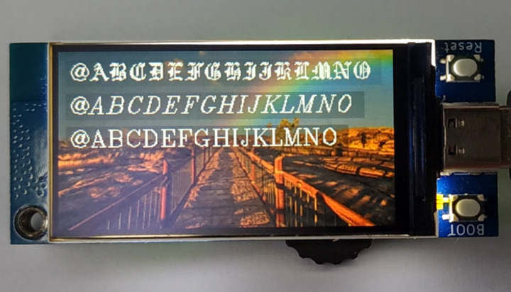

## 显示多种矢量字体

### draw 方法

`draw(vector_font, s, x, y {, fg, scale, alpha})`

绘制 s 文本到显示器，使用指定的Hershey矢量字体，坐标为文本的左下角。文本的前景色可以由可选参数fg设置，默认前景色为白色。文本的大小可以通过指定scale比例值进行缩放。scale必须大于0，可以是浮点数或整数值。scale默认为1.0。alpha透明度默认为255。

### draw_len 方法

`draw_len(vector_font, s {, scale})`

返回使用指定字体绘制的 s 字符串在像素中的宽度。

### 下载矢量字体库

在[GitHub:russhughes/st7789s3_esp_lcd/fonts/vector](https://github.com/russhughes/st7789s3_esp_lcd/tree/main/fonts/vector)仓库中有py文件格式的矢量字体库，在README中有所有字体的图样。

在[例程的lib](https://github.com/BPI-STEAM/BPI-Centi-S3-Doc/tree/main/micropython_example/07_display_multiple_vector_fonts/lib)中则还能下载到已转化为mpy文件格式的矢量字体库，占用更少的flash空间。

### 显示多种矢量字体并连续刷新

通过 draw_len 方法可以获取将要显示的字符串宽度，但已提供的部分矢量字体的高度会超过设定值，如果需要保持文本框完全覆盖它，则需要修改相应代码，增加文本框的高度。

> [从此GitHub链接下载完整例程](https://github.com/BPI-STEAM/BPI-Centi-S3-Doc/tree/main/micropython_example/07_display_multiple_vector_fonts)




```py
""" BPI-Centi-S3 170x320 ST7789 display """
import st7789
import tft_config
import gotheng
import italicc
import romanc
import time
import gc
from math import ceil

"""
These default colors can be used:
BLACK           BLUE            CYAN            GREEN
MAGENTA         RED             YELLOW          WHITE
TRANSPARENT

Custom RGB colors:
color565(255,255,255)
"""
class DrawRect:
    def __init__(self):
        self.tft = None
        self.text_y = None
        self.text_x = None
        self.rect_x = None
        self.rect_y = None
        self.rect_height = None
        self.rect_width = None

    def rect(self, tft, vector_font, scale, text, text_coord,
             fg=st7789.WHITE, bg=st7789.BLACK, alpha_text=255, alpha_rect=255):
        self.tft = tft
        self.rect_width = self.tft.draw_len(vector_font, text, scale)
        self.rect_height = ceil(vector_font.HEIGHT * scale)
        self.text_x = text_coord[0]
        self.text_y = text_coord[1]
        self.rect_x = ceil(self.text_x - vector_font.WIDTH * scale / 8)
        self.rect_y = round(self.text_y - vector_font.HEIGHT * scale / 2 + 1)
        self.tft.fill_rect(self.rect_x, self.rect_y,
                           self.rect_width, self.rect_height, bg, alpha_rect)
        self.tft.draw(vector_font, text, self.text_x, self.text_y,
                      fg, scale, alpha_text)

    def erase(self, bg):
        buffer, _, _ = self.tft.jpg_decode(bg, self.rect_x, self.rect_y, self.rect_width, self.rect_height)
        self.tft.blit_buffer(buffer, self.rect_x, self.rect_y, self.rect_width, self.rect_height)


def main():
    try:
        tft = tft_config.config(rotation=1)
        tft.init()
        jpg = 'pic_4.jpg'
        tft.jpg(jpg, 0, 0)
        text_x = 10
        text_y = 20
        text_list = [
            " !\"#$%&'()*+,-./",
            "0123456789:;<=>?",
            "@ABCDEFGHIJKLMNO",
            "PQRSTUVWXYZ[\]^_",
            "`abcdefghijklmno",
            "pqrstuvwxyz{|}~",
            ]

        draw_rect_1 = DrawRect()
        draw_rect_2 = DrawRect()
        draw_rect_3 = DrawRect()
        while True:
            for i in text_list:
                draw_rect_1.rect(tft, gotheng, 0.8, i, (text_x, text_y),
                                 fg=st7789.WHITE, bg=st7789.BLACK, alpha_text=255, alpha_rect=20)
                draw_rect_2.rect(tft, italicc, 0.8, i, (text_x, text_y+32),
                                 fg=st7789.WHITE, bg=st7789.BLACK, alpha_text=255, alpha_rect=40)
                draw_rect_3.rect(tft, romanc, 0.8, i, (text_x, text_y + 64),
                                 fg=st7789.WHITE, bg=st7789.BLACK, alpha_text=255, alpha_rect=60)
                tft.show()
                time.sleep(0.5)
                draw_rect_1.erase(bg=jpg)
                draw_rect_2.erase(bg=jpg)
                draw_rect_3.erase(bg=jpg)
                gc.collect()

    except BaseException as err:
        err_type = err.__class__.__name__
        print('Err type:', err_type)
        from sys import print_exception
        print_exception(err)

    finally:
        tft.deinit()
        print("tft deinit")


main()

```

### 放大或缩小字体

修改 draw 方法的 scale 比例值即可控制字体大小。


```py
""" BPI-Centi-S3 170x320 ST7789 display """
import st7789
import tft_config
import gotheng
import italicc
import romanc
import time
import gc
from math import ceil

"""
These default colors can be used:
BLACK           BLUE            CYAN            GREEN
MAGENTA         RED             YELLOW          WHITE
TRANSPARENT

Custom RGB colors:
color565(255,255,255)
"""
class DrawRect:
    def __init__(self):
        self.tft = None
        self.text_y = None
        self.text_x = None
        self.rect_x = None
        self.rect_y = None
        self.rect_height = None
        self.rect_width = None

    def rect(self, tft, vector_font, scale, text, text_coord,
             fg=st7789.WHITE, bg=st7789.BLACK, alpha_text=255, alpha_rect=255):
        self.tft = tft
        self.rect_width = self.tft.draw_len(vector_font, text, scale)
        self.rect_height = ceil(vector_font.HEIGHT * scale)
        self.text_x = text_coord[0]
        self.text_y = text_coord[1]
        self.rect_x = ceil(self.text_x - vector_font.WIDTH * scale / 8)
        self.rect_y = round(self.text_y - vector_font.HEIGHT * scale / 2 + 1)
        self.tft.fill_rect(self.rect_x, self.rect_y,
                           self.rect_width, self.rect_height, bg, alpha_rect)
        self.tft.draw(vector_font, text, self.text_x, self.text_y,
                      fg, scale, alpha_text)

    def erase(self, bg):
        buffer, _, _ = self.tft.jpg_decode(bg, self.rect_x, self.rect_y, self.rect_width, self.rect_height)
        self.tft.blit_buffer(buffer, self.rect_x, self.rect_y, self.rect_width, self.rect_height)


def main():
    try:
        tft = tft_config.config(rotation=1)
        tft.init()
        jpg = 'pic_4.jpg'
        tft.jpg(jpg, 0, 0)
        text_x = 10
        text_y = 20
        text_list = [
            "!\"#$%&'()*",
            "0123456789",
            "ABCDEFGHI",
            "PQRSTUVWX",
            "abcdefghij",
            "pqrstuvwxy",
            ]

        draw_rect_1 = DrawRect()
        draw_rect_2 = DrawRect()
        draw_rect_3 = DrawRect()
        while True:
            for i in text_list:
                draw_rect_1.rect(tft, romanc, 0.5, i, (text_x, text_y),
                                 fg=st7789.WHITE, bg=st7789.BLACK, alpha_text=255, alpha_rect=20)
                draw_rect_2.rect(tft, romanc, 1, i, (text_x, text_y+24),
                                 fg=st7789.WHITE, bg=st7789.BLACK, alpha_text=255, alpha_rect=40)
                draw_rect_3.rect(tft, romanc, 1.5, i, (text_x, text_y + 64),
                                 fg=st7789.WHITE, bg=st7789.BLACK, alpha_text=255, alpha_rect=60)
                tft.show()
                time.sleep(0.5)
                draw_rect_1.erase(bg=jpg)
                draw_rect_2.erase(bg=jpg)
                draw_rect_3.erase(bg=jpg)
                gc.collect()

    except BaseException as err:
        err_type = err.__class__.__name__
        print('Err type:', err_type)
        from sys import print_exception
        print_exception(err)

    finally:
        tft.deinit()
        print("tft deinit")


main()

```