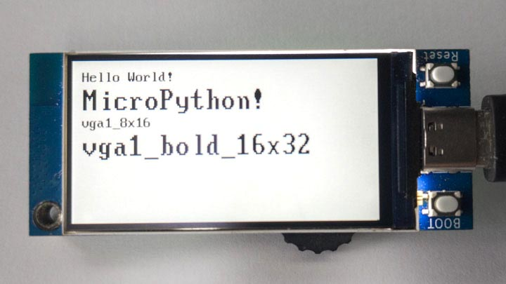
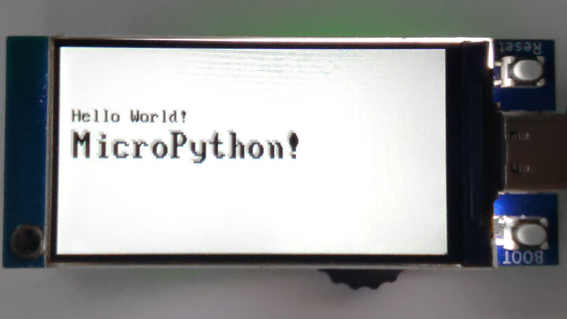

## 显示文本字符

### text 方法

`text(font, s, x, y {, fg, bg, alpha})`

使用指定的位图字体 `font` ，将文本字符 `s` 写入显示器的指定坐标，坐标 `x,y` 为文本的左上角。 

可选参数 `fg` 和 `bg` 可以设置文本的前景色和背景色； 若不设置这两个参数，则前景色默认为白色，背景色默认为黑色。

`alpha` 默认为 255。

### 位图字体

BPI-Centi-S3 出厂固件中有包含两个位图字体文件。

`vga1_8x16.mpy`

`vga1_bold_16x32.mpy`

它们来自于 https://github.com/russhughes/st7789s3_esp_lcd/tree/main/fonts/bitmap 。

我从中选取了这两个最常用的，使用[mpy-cross工具](https://pypi.org/project/mpy-cross/)将它们转化为`.mpy`格式，以此缩小文件体积。

### 下载字体文件

如果你误删了字体文件，或擦除过flash，则需再次下载字体文件，你可以从前文链接中下载，也可从下方链接中下载已转化为`.mpy`格式的字体与例程文件。

[从此链接下载字体与例程文件](https://github.com/BPI-STEAM/BPI-Centi-S3-Doc/tree/main/micropython_example/04_display_text)

### 显示文本



```py
""" BPI-Centi-S3 170x320 ST7789 display """

import st7789
import tft_config
import vga1_8x16
import vga1_bold_16x32

"""
These default colors can be used:
BLACK           BLUE            CYAN            GREEN
MAGENTA         RED             YELLOW          WHITE
TRANSPARENT

Custom RGB colors:
color565(255,255,255)
"""
fg = st7789.BLACK
bg = st7789.WHITE
text_x = 10
text_y = 10

def main():
    try:
        tft = tft_config.config(rotation=1)
        tft.init()
        tft.fill(st7789.WHITE)
        tft.text(vga1_8x16, "Hello World!", text_x, text_y, fg, bg, 255)
        tft.text(vga1_bold_16x32, "MicroPython!", text_x, text_y+16, fg, bg, 255)
        tft.text(vga1_8x16, "vga1_8x16", text_x, text_y+16+32, fg, bg, 255)
        tft.text(vga1_bold_16x32, "vga1_bold_16x32",
                 text_x, text_y+16+32+16, fg, bg, 255)
        tft.show()

    except BaseException as err:
        err_type = err.__class__.__name__
        print('Err type:', err_type)
        from sys import print_exception
        print_exception(err)

    finally:
        tft.deinit()
        print("tft deinit")


main()

```

### 使用透明背景与Alpha 通道制作阴影字体



合理利用 st7789.TRANSPARENT 作为文本的背景色，可以使文本的背景不发生变化。

再通过设置 text 方法 中的 alpha 参数，可以改变文本整体的透明度，范围为0~255。

```py
""" BPI-Centi-S3 170x320 ST7789 display """

import st7789
import tft_config
import vga1_8x16
import vga1_bold_16x32

"""
These default colors can be used:
BLACK           BLUE            CYAN            GREEN
MAGENTA         RED             YELLOW          WHITE
TRANSPARENT

Custom RGB colors:
color565(255,255,255)
"""
fg = st7789.BLACK
bg = st7789.TRANSPARENT
text_x = 10
text_y = 50

def main():
    try:
        tft = tft_config.config(rotation=1)
        tft.init()
        tft.fill(st7789.WHITE)
        tft.text(vga1_8x16, "Hello World!", text_x-1, text_y-1, fg, bg, 205)
        tft.text(vga1_bold_16x32, "MicroPython!", text_x-2, text_y+16-2, fg, bg, 205)
        tft.text(vga1_8x16, "Hello World!", text_x, text_y, fg, bg, 255)
        tft.text(vga1_bold_16x32, "MicroPython!", text_x, text_y+16, fg, bg, 255)
        tft.show()

    except BaseException as err:
        err_type = err.__class__.__name__
        print('Err type:', err_type)
        from sys import print_exception
        print_exception(err)

    finally:
        tft.deinit()
        print("tft deinit")


main()

```