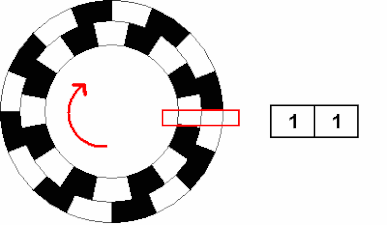

## 使用旋转编码器与菜单栏交互，做一个电子相册

BPI-Centi-S3上自带一个增量型旋转编码器，利用它可以很方便的与屏幕上显示的内容进行交互控制。

### 增量型旋转编码器

1. 增量型旋转编码器外观粗看与一些常见的旋转电位器相似，其关键的不同之处大致分为三点。

   1.1 微控制器使用ADC外设来读取旋转电位器输出的模拟信号（电压值），确定转轴当前角位；微控制器通过GPIO接收增量型旋转编码器输出的数字信号，可通过软件程序判断信号所对应的转轴动作。

   1.2 微控制器可在一定精度下，确定旋转电位器转轴当前角位，但因为模拟信号的持续性与抗干扰能力差的原因，无法准确判断它是否有动作；增量型旋转编码器仅在转轴运动到一个触点时，向微控制器发出一段动作数字信号，如果一个增量型旋转编码器一周有20个触点，它旋转一周就触发20次动作信号，微控制器可以精确的判断它是否动作，向哪个方向转动，信号触发了多少次。

   1.3 旋转电位器通常不可向任意转向进行无限旋转，会停止在最大或最小限位点；增量型旋转编码器可向任意转向进行无限旋转。

2. 增量型旋转编码器采用正交编码器生成其A和B的输出信号。从A和B输出发射的脉冲是正交编码的，这意味着当增量编码器以恒定速度运动时，A和B波形是方波，A和B之间存在90度的相位差。最终A和B信号将从两个管脚传输给微控制器。
    

3. 理论上，在任何特定时间，对于旋转编码器，A和B信号之间，顺时针旋转的相位差为+90°，逆时针旋转的相位差为−90°，具体则取决于设备内部的正交编码器设计。
4. A或B输出上的脉冲频率与转轴的速度（位置变化率）成正比。较高的频率表示较快的速度，而较低的频率表示较慢的速度。当转轴静止时，静态、不变的信号输出在A和B上，所以有很多测速方案使用增量型旋转编码器。
> 参考 [维基百科: 增量编码器](https://en.wikipedia.org/wiki/Incremental_encoder#Quadrature_decoder) 。