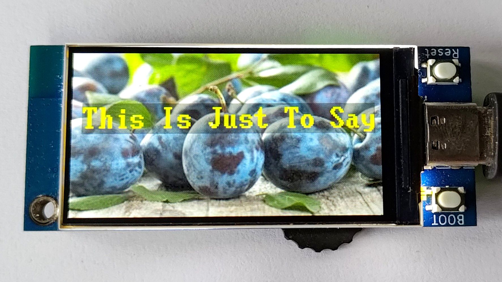

## 在JPG上刷新文本框

### jpg_decode 方法

`jpg_decode(jpg_filename {, x, y, width, height})`

解码一个jpg文件并返回一个元组，包括（buffer, width, height）。buffer缓冲区是一个与color565 blit_buffer兼容的字节数组。缓冲区将需要 width宽度 * height高度 * 2字节的内存。

如果提供了可选的 x, y, width, height 参数，buffer缓冲区将只包含图像的指定区域。


### blit_buffer 方法

`blit_buffer(buffer, x, y, width, height {, alpha})`

将bytes()或bytearray()的内容复制到屏幕内存中，x, y, width, height指定区域。注意：数组中每个颜色需要2字节。alpha默认为255。

### 在JPG上局部刷新半透明文本框


在[根据字符长度创建半透明文本框](./Make_semi-transparent_rectangular_text_box.md#根据字符长度创建半透明文本框)的基础上，将text_rect方法改写为一个class类，并增加一个erase方法，在其中使用jpg_decode 方法储存半透明文本框背景，再使用blit_buffer 方法覆盖掉半透明文本框，实现局部刷新。



> [从此GitHub链接下载完整例程](https://github.com/BPI-STEAM/BPI-Centi-S3-Doc/tree/main/micropython_example/06_textbox_partial_refresh)

```py
""" BPI-Centi-S3 170x320 ST7789 display """

import st7789
import vga1_bold_16x32
import tft_config
import gc
import time


class TextRect:
    def __init__(self):
        self.tft = None
        self.text_y = None
        self.text_x = None
        self.rect_height = None
        self.rect_width = None

    def rect(self, tft, font, text, text_coord,
             fg=st7789.WHITE, bg=st7789.BLACK, alpha_text=255, alpha_rect=255):
        self.tft = tft
        self.rect_width = font.WIDTH * len(text)
        self.rect_height = font.HEIGHT
        self.text_x = text_coord[0]
        self.text_y = text_coord[1]
        self.tft.fill_rect(self.text_x, self.text_y,
                           self.rect_width, self.rect_height, bg, alpha_rect)
        self.tft.text(font, text, self.text_x, self.text_y,
                      fg, st7789.TRANSPARENT, alpha_text)

    def erase(self, bg):
        buffer, _, _ = self.tft.jpg_decode(bg, self.text_x, self.text_y, self.rect_width, self.rect_height)
        self.tft.blit_buffer(buffer, self.text_x, self.text_y, self.rect_width, self.rect_height)


def main():
    try:
        text_x = 10
        text_y = int(170 / 2 - 32)
        tft = tft_config.config(rotation=1)
        jpg = 'pic_6.jpg'
        text_list = [
            "This Is Just To Say",
            "I have eaten",
            "the plums",
            "that were in",
            "the icebox",

            "and which",
            "you were probably",
            "saving",
            "for breakfast",

            "Forgive me",
            "they were delicious",
            "so sweet",
            "and so cold"]

        tft.init()
        gc.collect()
        tft.jpg(jpg, 0, 0)
        text_rect_1 = TextRect()
        while True:
            for i in text_list:
                text_rect_1.rect(tft, vga1_bold_16x32, i, (text_x, text_y),
                                 fg=st7789.YELLOW, bg=st7789.BLACK, alpha_text=30, alpha_rect=80)
                tft.show()
                time.sleep(0.5)
                text_rect_1.erase(bg=jpg)
                gc.collect()

    except BaseException as err:
        err_type = err.__class__.__name__
        print('Err type:', err_type)
        from sys import print_exception
        print_exception(err)

    finally:
        tft.deinit()
        print("tft deinit")


main()
 
```