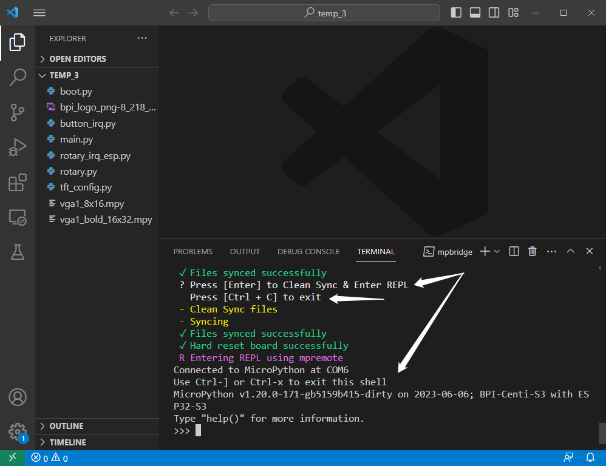
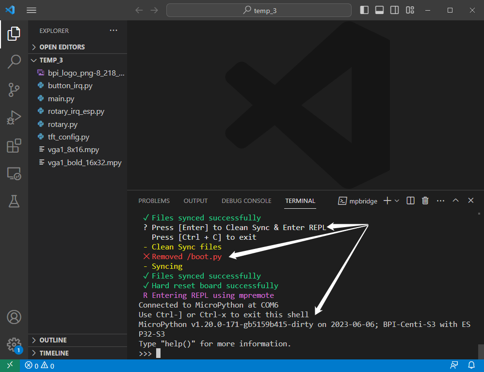

## VScode + mpbridge工具使用方法

> 需要先[安装 Visual Studio Code](./environment.md#安装-visual-studio-code)，[安装mpbridge工具](./environment.md#安装mpbridge工具)。

### Python扩展

在扩展项中搜索`python`，安装Python扩展支持。


### 打开文件夹

在文件资源管理器项中点击`Open Folder`，打开一个文件夹，或新建一个空白文件夹。

这里尤其建议新手先从一个空白文件夹开始上手。


### 打开终端

点击`Terminal`项，点击`New Terminal`项，将会打开一个新的终端窗口，通常出现在下方框体中。


### mpbridge列出串行端口编号

首先应确保你的MicroPython开发板已与你的计算机建立串行数据连接。

在终端中输入以下命令并点击回车键，将列出计算机上所有串行端口编号。
```sh
mpbridge list
```


如果你的计算机中仅有连接一个串行设备，且它就是你的MicroPython开发板，那么这个串行端口编号就是开发板的。

如果你的计算机连接多个串行设备，你可以通过接入设备查看一次编号列表，拔出设备查看一次编号列表，来找到唯一变动的一项，这一项就是你的MicroPython开发板的串行端口编号。

### mpbridge 连接开发板

在终端中输入以下命令，将末尾的串行端口编号修改为上一步所确定的编号，然后点击回车键，如果你当前打开的是一个空白文件夹的话，mpbridge工具将首先将MicroPython开发板上的文件拷贝到此文件夹内。
```sh
mpbridge dev --auto-reset hard COM6
```


当文件拷贝完成后，终端中将显示:
```
 ? Press [Enter] to Clean Sync & Enter REPL
   Press [Ctrl + C] to exit
```

想要进入REPL则再次单击回车键，想要退出工具则使用 `Ctrl + C`快捷键。

在进去REPL前，开发板会被硬复位一次，以便于立即查看程序结果。

如果你不希望硬复位，则使用这个命令：
```sh
mpbridge dev COM6
```

如果你想使用软复位，则：
```sh
mpbridge --auto-reset soft COM6
```



当你进入REPL后，在任何时候，你仅需使用`Ctrl + X`快捷键即可退出REPL。


### 修改或新增文件

如果你在退出REPL之前，在本地文件夹中修改了某个文件内的代码，或是增加了某个文件，mpbridge工具将自动检查变更的文件并同步到开发板上。

```sh
mpbridge dev --auto-reset hard COM6
```

在终端中开始运行这个命令时，也会这么做。


### 删除文件

```sh
mpbridge dev --auto-reset hard COM6
```

当这个命令完成了文件的同步后，终端中将显示:
```
 ? Press [Enter] to Clean Sync & Enter REPL
   Press [Ctrl + C] to exit
```

如果你需要删除某个或多个文件，则先在本地文件夹内删除它，然后再点击回车键，mpbridge工具将自动执行`Clean Sync`，将开发板中的同名文件也删除掉，最后进入REPL。




如果你仅仅想要临时删除开发板上的文件，而需要在计算机本地保留文件，请记得提前备份文件到其他文件夹中。

### mpbridge 做了什么？

```sh
mpbridge dev --auto-reset hard COM6
```

开始运行这个命令时，以及退出REPL后，mpbridge都将自动进行这些文件操作：

1. 将存在于本地但不存在于设备中的文件推送到设备中。
2. 对同时存在于本地和设备中的文件进行哈希检查，将不同的文件从本地推送到设备中。
3. 将不存在于本地但存在于设备中的文件拉取到本地。

每当终端显示此提示时：
```
 ? Press [Enter] to Clean Sync & Enter REPL
   Press [Ctrl + C] to exit
```

再次按下回车键，mpbridge都将自动进行这些文件操作：

1. 将存在于本地但不存在于设备中的文件推送到设备中。
2. 对同时存在于本地和设备中的文件进行哈希检查，将不同的文件从本地推送到设备中。
3. 将不存在于本地但存在于设备中的文件，从设备中删除。
4. 硬复位设备，进入REPL。

若是此时按下`Ctrl + C`快捷键，则会退出mpbridge工具。