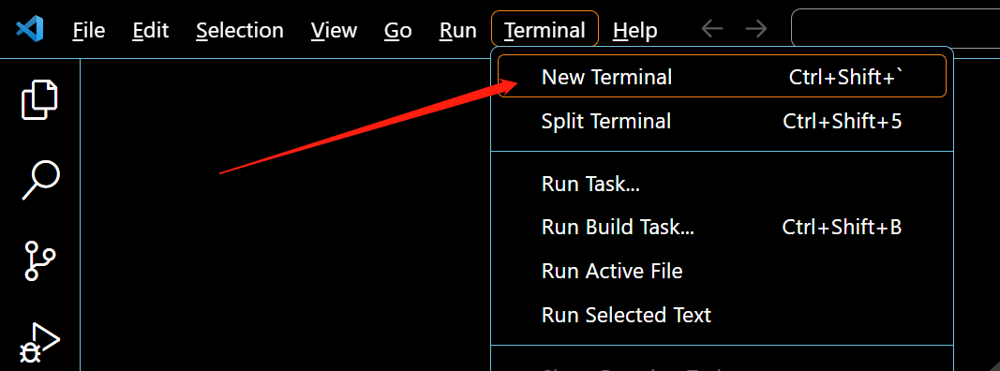
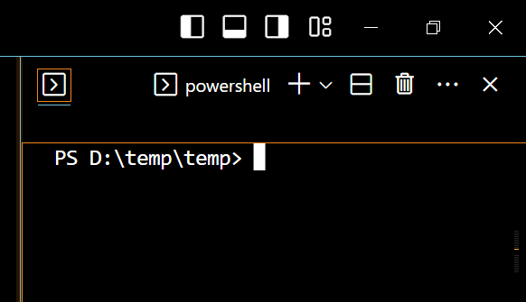
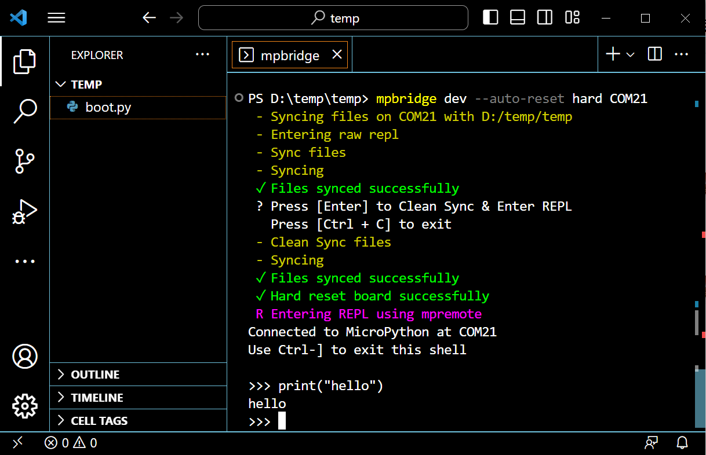

## 什麼是 MicroPython？


[MicroPython](https://micropython.org/) 是Python 3程式設計語言的精實高效實現，包括Python標準庫的一小部分，並且經過優化，可在微控制器和有限的硬體資源中運行。

由[Damien P. George](https://dpgeorge.net/)）於2013年眾籌開源。

它與使用C程式開發微控制器最明顯的差异性，就是驗證程式碼時無需漫長的編譯。

使用串口通信軟件，通過REPL（read-eval-print-loop）輸入命令來控制微控制器，和Python的REPL一樣。

也可使用一些工具將python腳本檔案上傳到微控制器內運行。

它對Python 3的實現，包括了支持多執行緒的_ thread庫，編寫併發程式碼的asyncio庫。

它盡可能與普通Python相容，允許您輕鬆地將程式碼從案頭端移植到微控制器。

同時它還具備一些特定用於微控制器的庫，以便充分利用微控制器晶片內的硬體功能，例如計时器，硬體中斷，WiFi等，這取決於具體的硬體。

在具備上述特性的同時，它的硬體開銷很少，最低只需256k的程式碼空間和16k的RAM即可運行。

如果你瞭解Python，很大程度上你就已經瞭解MicroPython了。

在另一方面，你深入地學習MicroPython，也能提升你對Python的理解。

## 配置開發環境

### 系統環境需求

支持在 Windows 10、Windows 11，MacOS，Ubuntu 或其他 Linux 桌面操作系統中開發。

本文所有的應用示例基於 Windows 10 操作系統，其他操作系統也可參考使用。


### 安裝Python環境

打開[Python官網](https://www.python.org/) 。

對於Windows 系統來說，最便捷的安裝包下載方法就是在官網首頁點擊如下圖所示的圖標進行下載。


其他操作系統或是其他發行版本則可以在 Downloads 選項欄中進行選擇。

建議使用python 3.7以上的版本。

開始安裝時一定要記得勾選Add Python 3.x to PATH，這樣可以免除再手動添加進PATH。


按照安裝提示逐步操作即可順利完成安裝 。

### 安裝mpremote工具

MicroPython 開源社區現已推出一款開發輔助工具：mpremote ，我們可以通過它與開發板建立串口通信，使用REPL，管理開發板上的檔案系統，它還具有 mount 和 mip 功能，將在後續章節詳述（準備中）。

安裝完Python環境後，即可在終端使用pip安裝mpremote了。

在Windows系統中打開PowerShell，其他操作系統則打開對應的終端，輸入以下命令安裝 mpremote。

```
pip install mpremote
```

### 安裝mpbridge工具

mpbridge 是基於 mpremote 開發的CLI工具，主要提供自動化同步檔案的功能，提高開發效率。

在終端中輸入以下命令安裝 mpbridge。

```
pip install mpbridge
```

### 任選一個編輯器

MicroPython的使用並不依賴於特定的開發工具，只要能與開發板建立串口通信，即可獲得 MicroPython的交互式解釋器（REPL）。

很純粹的說，我們基本只需要一個文本編輯器來編輯代碼，然後通過mpremote工具或mpbridge工具上傳我們的 .py 腳本檔案或其他檔案到開發板中即可。

對於具體的編輯器，綜合基本的代碼補全、語法高亮、集成終端以及輕量化、多平台適配的需求，我推薦使用 Visual Studio Code (VScode) ，它也可能已經是你最熟悉的工具之一了。

[Visual Studio Code 官網地址](https://code.visualstudio.com/)

可能需要參考的VScode文檔：
* [VScode 中文簡易教程](https://www.runoob.com/w3cnote/vscode-tutorial.html?ivk_sa=1025883i)
* [Visual Studio Code 官方文檔](https://code.visualstudio.com/docs)
    * [基本安裝，設置](https://code.visualstudio.com/docs/setup/setup-overview)
    * [設置顯示語言](https://code.visualstudio.com/docs/getstarted/locales)
    * [使用集成終端](https://code.visualstudio.com/docs/terminal/basics)
> 官方文檔為英文，中文用戶可以使用網頁在線翻譯功能輔助閱覽，[Edge瀏覽器的在線翻譯使用方法](https://support.microsoft.com/zh-cn/topic/%E5%9C%A8microsoft-edge%E6%B5%8F%E8%A7%88%E5%99%A8%E4%B8%AD%E4%BD%BF%E7%94%A8microsoft-%E7%BF%BB%E8%AF%91%E5%B7%A5%E5%85%B7-4ad1c6cb-01a4-4227-be9d-a81e127fcb0b)。

All in Web 人士，極簡主義人士，試試[Web端的VScode](https://vscode.dev/)，本地操作系統開個終端使用mpremote或mpbridge同步檔案，MicroPython REPL。

其他推薦的編輯器：
* [PyCharm 社區版](https://www.jetbrains.com/pycharm/download/#section=windows) ，免費的社區版，夠用，還帶有micropython特殊庫的代碼補全，雖然不完整且很久沒更新了。
* [Jupyter](https://jupyter.org/) 同樣是Web端的編輯器，專業性更強，更python，還支持網頁終端。
* [Thonny](https://github.com/thonny/thonny/releases) ，樹莓派基金會贊助過的開源圖形化python編輯器，Raspberry Pi OS（Raspbian）出廠集成，樹莓派用戶入門首選。

## 燒錄固件

> BPI-Centi-S3 出廠已燒錄了具備st7789並口驅動的MicroPython固件，通常可跳過此步。

如果你在開發產生意外的惡性BUG使開發板無法正常啟動，或其他原因導致固件被擦除或損壞，你可以從下面的 github 鏈接中找到已編譯好的固件自行燒錄。

[BPI-Centi-S3 micropython固件，github存檔](https://github.com/BPI-STEAM/BPI-Centi-S3-Doc/tree/main/micropython_st7789s3_firmware)

### 安裝esptool工具

在終端中輸入以下命令安裝 esptool。

```
pip install esptool
```

### esptool命令

> 所有對flash的操作都是不可逆的，注意備份有價值的數據。

* 擦除flash

```
python -m esptool --chip esp32s3 --port COM1 --baud 460800 erase_flash
```

* 寫入flash

```
python -m esptool --chip esp32s3 --port COM1 --baud 460800 --before=usb_reset --after=no_reset write_flash 0x0 esp32s3_micropython_qspram_st7789s3_idf4.4.3.bin
```

## 連接開發板

### 在終端中使用mpremote

點擊VScode的Terminal/終端，新建一個終端窗口後即可在終端輸入命令。

如果使用的是其他編輯器，或是僅使用系統本地終端，亦可直接使用。



`--help`可查看所有mpremote的可用命令:
```
mpremote --help
```

列出所有串行接口的命令：
```
mpremote connect list
```

連接開發板所在的串行接口並進入MicroPython REPL：
```
mpremote connect COM1 repl
```

`COM1`是Windows系統中的串行接口的格式，在Linux中可能是`/dev/ttyACM0`，在MacOS中可能是`/dev/cu.usbmodem01`。

進入REPL後，可以輸入MicroPython代碼使其在開發板中運行。
```python
>>>print("Hello")
```

退出REPL的方法是鍵盤快捷鍵`ctrl + ]`。

### 在終端中使用mpbridge

mpbridge工具最主要的功能就是將本地一個檔案夾與開發板中的檔案系統同步，所以我們首先就是確定要同步的檔案夾。

在PC本地某個你認為合適的位置新建一個檔案夾，或是選擇一個檔案夾，然後在VScode中打開此檔案夾。


然後在VScode打開一個終端，即可在終端中進入此檔案夾所在的路徑。



如果你使用的是默認終端，則可使用 `cd [目標檔案夾絕對路徑]`進入此路徑。

```sh
PS C:\Users\Wind> cd D:\temp\temp
PS D:\temp\temp>
```

使用mpbridge工具列出所有串行接口的命令：
```
mpbridge list
```

使用mpbridge工具同步檔案，命令如下，注意將`COM1`修改為開發板實際對應的串口：
```
mpbridge dev --auto-reset hard COM1
```



當同步完成後，會提示按`Enter`鍵，按下後開發板硬件復位，終端將進入MicroPython REPL。

按鍵盤快捷鍵`ctrl + ]`退出REPL後，會立即再次同步一次檔案，此時可選擇按`ctrl + C`退出。

每次同步，mpbridge都將自動進行這些檔案操作：

1. 將存在於本地但不存在於設備中的檔案推送到設備中。
2. 將不存在於本地但存在於設備中的檔案拉取到本地。
3. 對同時存在於本地和設備中的檔案進行哈希檢查，將不同的檔案從本地推送到設備中。

## 基礎用例

### 荧幕

BPI-Centi-S3正面有一塊1.9英寸TFT LCD彩屏，分辯率是170*320，驅動晶片為ST7789V3，採用8bit平行介面與ESP32S3晶片連接。

出廠固件中已集成ST7789 C模塊驅動，來自於：

[russhughes/st7789s3_esp_lcd](https://github.com/russhughes/st7789s3_esp_lcd) , The MIT License

感謝russhughes的開源，在他的GitHub README中可以查閱編譯方法和所有API介面。

#### 初始化，點亮荧幕

<iframe width="560" height="315" src="https://www.youtube.com/embed/YANtoaNBQw4" title="YouTube video player" frameborder="0" allow="accelerometer; autoplay; clipboard-write; encrypted-media; gyroscope; picture-in-picture; web-share" allowfullscreen></iframe>

在本地檔案夾中創建一個 main.py ，將下方代碼拷貝進去，保存檔案。

> 使用 `ctrl + S` 快捷鍵即可保存當前窗口中的檔案。

```py
""" BPI-Centi-S3 170x320 ST7789 display """

import st7789
from machine import freq


def config(rotation=0, options=0):

    return st7789.ST7789(
        170,
        320,
        15, 14, 13, 12, 11, 10, 9, 8,
        wr=6,
        rd=7,
        reset=3,
        dc=5,
        cs=4,
        backlight=2,
        power=2,
        rotation=rotation,
        options=options)


freq(240_000_000)  # Set esp32s3 cpu frequency to 240MHz
tft = config(rotation=1, options=0)
tft.init() # Initialize
tft.fill(st7789.RED) 
tft.show(True)
tft.deinit()  # Deinitialize the display or it will cause a crash on the next run

```

使用mpbridge同步檔案到開發板。
> [安裝mpbridge](#安裝mpbridge工具) | [使用mpbridge](#在終端中使用mpbridge)

同步完成後，BPI-Centi-S3 荧幕將全屏顯示紅色。

#### 單獨的配置檔案

我們可以將初始化配置ST7789的代碼單獨置於一個python腳本檔案中，然後在其他地方任意導入使用，包括在REPL中，這可以增強代碼復用性。

新建一個單獨的配置檔案 tft_config.py ，將下方代碼拷貝進去，保存檔案。

```py
""" BPI-Centi-S3 170x320 ST7789 display """

import st7789
from machine import freq


def config(rotation=0, options=0):

    return st7789.ST7789(
        170,
        320,
        15, 14, 13, 12, 11, 10, 9, 8,
        wr=6,
        rd=7,
        reset=3,
        dc=5,
        cs=4,
        backlight=2,
        power=2,
        rotation=rotation,
        options=options)

freq(240_000_000)  # Set esp32s3 cpu frequency to 240MHz

```

將 main.py 修改為如下代碼：

```py
""" BPI-Centi-S3 170x320 ST7789 display """

import st7789
import tft_config

tft = tft_config.config(rotation=1, options=0)
tft.init()
tft.fill(st7789.RED) 
tft.show(True)
tft.deinit()  # Deinitialize the display or it will cause a crash on the next run

```

使用mpbridge同步檔案到開發板。
> [安裝mpbridge](#安裝mpbridge工具) | [使用mpbridge](#在終端中使用mpbridge)

後續我們就可以像這樣簡單的導入然後初始化荧幕了。

#### 顯示jpg圖片

<iframe width="560" height="315" src="https://www.youtube.com/embed/jR3LpkfWWy8" title="YouTube video player" frameborder="0" allow="accelerometer; autoplay; clipboard-write; encrypted-media; gyroscope; picture-in-picture; web-share" allowfullscreen></iframe>

sst7789驅動庫內有一個顯示jpg格式圖片的方法，這對於初次上手學習的我們非常友好。

##### jpg 方法

`jpg(jpg_filename, x, y)`

在給定的 x 和 y 坐標處繪製一個 JPG 檔案，坐標為圖片的左上角。

此方法需要額外的 3100 字節內存用於其工作緩衝區。

##### 準備合適大小的jpg檔案

任選自己喜歡的圖片，裁切為長320像素，寬170像素，或小於此尺寸的圖片。

圖片編輯工具在各種智能終端設備中和各種操作系統中都有大量可選的，可任意使用自己喜歡的工具來編輯。

這裡隨意推荐一個能免費使用的 Web 在線圖片編輯工具，[Pixlr X](https://pixlr.com/cn/x/) 。

將裁切好的圖片放入我們本地的MicroPython工作檔案夾中，重命名為 `pic_1.jpg` ，上傳圖片到MicroPython設備中的方法參考 [在終端中使用mpbridge](#在終端中使用mpbridge) 。

這裡已準備一張已裁切好尺寸的圖片。


##### jpg 方法用例

在 main.py 腳本中使用 jpg 方法。

```py
""" BPI-Centi-S3 170x320 ST7789 display """

import st7789
import tft_config
import gc

def main():
    try:
        tft = tft_config.config(rotation=1)
        tft.init()
        tft.jpg("pic_1.jpg", 0, 0)
        tft.show()
        gc.collect()

    except BaseException as err:
        err_type = err.__class__.__name__
        print('Err type:', err_type)
        from sys import print_exception
        print_exception(err)

    finally:
        tft.deinit()
        print("tft deinit")


main()

```

上傳main.py後，將設備復位，即可在荧幕上看到圖片。

我們再多準備幾個合適大小的jpg檔案，即可設計一個迴圈，像播放幻燈片一樣在BPI-Centi-S3的荧幕上輪播圖片了。


```py
""" BPI-Centi-S3 170x320 ST7789 display """

import st7789
import tft_config
import gc
import time

pic_list = ["pic_1.jpg", "pic_2.jpg", "pic_3.jpg", "pic_4.jpg", "pic_5.jpg"]


def main():
    try:
        tft = tft_config.config(rotation=1)
        tft.init()
        while True:
            for pic in pic_list:
                tft.jpg(pic, 0, 0)
                tft.show()
                gc.collect()
                time.sleep(1)

    except BaseException as err:
        err_type = err.__class__.__name__
        print('Err type:', err_type)
        from sys import print_exception
        print_exception(err)

    finally:
        tft.deinit()
        print("tft deinit")


main()

```
