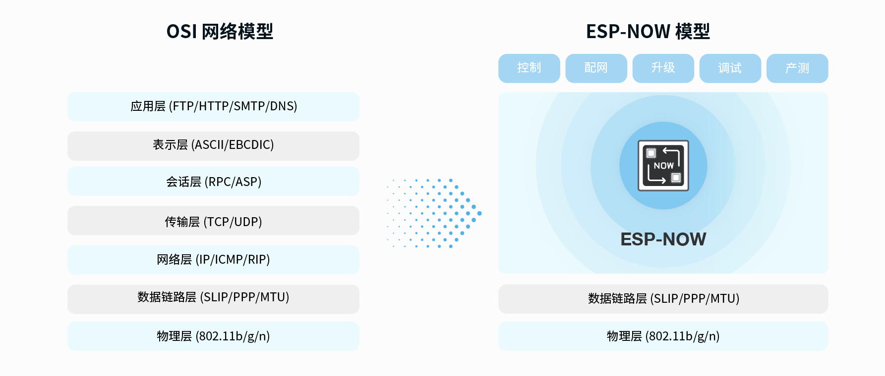

## 什么是ESP-NOW？

ESP-NOW 是乐鑫定义的一种无线通信协议，能够在无路由器的情况下直接、快速、低功耗地控制智能设备。它能够与 Wi-Fi 和 Bluetooth LE 共存，支持乐鑫 ESP8266、ESP32、ESP32-S 和 ESP32-C 等多系列 SoC。ESP-NOW 广泛应用于智能家电、远程控制和传感器等领域。

ESP-NOW 是基于数据链路层的无线通信协议，它将五层 OSI 上层协议精简为一层，数据传输时无需依次经过网络层、传输层、会话层、表示层、应用层等复杂的层级，也无需层层增加包头和解包，大大缓解了网络拥挤时因为丢包而导致的卡顿和延迟，拥有更高的响应速度。



* ESP-NOW 可与 Wi-Fi、Bluetooth LE 共存，支持乐鑫多系列支持 Wi-Fi 功能的 SoC。
* 配对快速且用户友好，支持单对多、多对多设备连接和控制。
* 占用较少的 CPU 和 flash 资源。
* 可以作为独立的辅助模块，为系统提供设备配网、调试和固件升级等功能。
* 基于 ECDH 和 AES 算法保证数据传输具有更高的安全性。
* 新增窗口同步机制，极大地降低了功耗。

MicroPython 已将 ESP-NOW 的功能支持合并入GitHub master ，[#6515](https://github.com/micropython/micropython/pull/6515)。

> [MicroPython ESP-NOW API 文档](https://docs.micropython.org/en/latest/library/espnow.html)

## 实现一个最简单的无线通信，点亮彩灯

使用两块BPI-Leaf-S3开发板，一个做为发送端，一个作为接收端，无需提前连接任何wifi。

发送端将在启动后广播一段信息，然后进入循环等待接收一个返回的信息，如果收到一个返回信息则亮一下蓝灯。

接收端将在启动后进入循环接收信息，在接收到信息后打印信息，如果收到信息则亮一下绿灯，并向发送端返回一个信息，然后继续接收信息。

**发送端**

```py
import network
import espnow
import time
from neopixel import NeoPixel
from machine import Pin

np = NeoPixel(Pin(48), 25)
np[0] = (0, 0, 0)
np.write()

# A WLAN interface must be active to send()/recv()
sta = network.WLAN(network.STA_IF)
sta.active(True)
sta.disconnect()

e = espnow.ESPNow()
e.active(True)
peer = b'\xbb\xbb\xbb\xbb\xbb\xbb'   # MAC address of peer's wifi interface
e.add_peer(peer)      # Must add_peer() before send()

e.send(peer, "Starting...", True)
for i in range(100):
    e.send(peer, str(i)*20, True)
sended = e.send(peer, b'end', True)
print(sended)
while True:
    host, msg = e.recv()
    if msg:             # msg == None if timeout in recv()
        print(host, msg)
        if msg == b'All received.':
            np[0] = (0, 0, 25)
            np.write()
            time.sleep(0.5)
            np[0] = (0, 0, 0)
            np.write()
        break

```

**接收端**

```py
import network
import espnow
import time
from neopixel import NeoPixel
from machine import Pin

np = NeoPixel(Pin(48), 25)
np[0] = (0, 0, 0)
np.write()

# A WLAN interface must be active to send()/recv()
sta = network.WLAN(network.STA_IF)
sta.active(True)
sta.disconnect()

e = espnow.ESPNow()
e.active(True)

while True:
    host, msg = e.recv()
    if msg:             # msg == None if timeout in recv()
        print(host, msg)

        if msg == b'end':
            try:
                e.add_peer(host)  # Must add_peer() before send()
            except OSError:
                pass
            sended = e.send(host, "All received.", True)
            print(sended)
            np[0] = (0, 25, 0)
            np.write()
            time.sleep(0.5)
            np[0] = (0, 0, 0)
            np.write()

```

