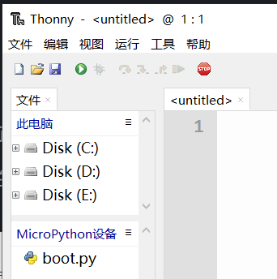
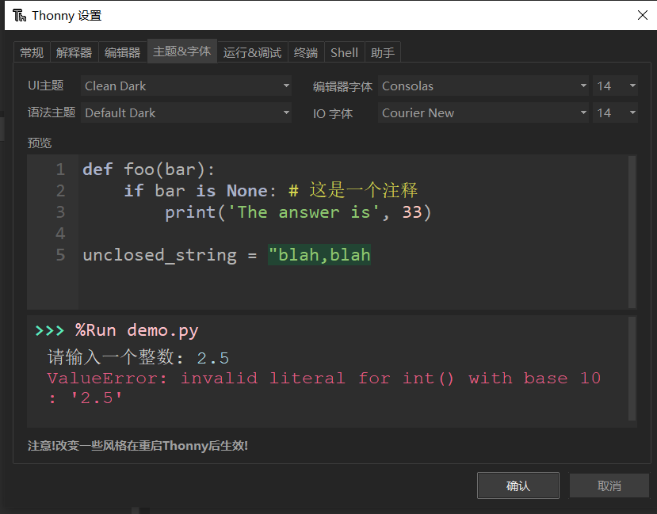

# Micropython 运行环境设置

Micropython的运行环境依赖于Python，所以我们在使用之前需要先安装Python。 我们这里使用的 IDE 是 Thonny。

## 安装Python环境

打开 [Python 官网页面](https://www.python.org/).

对于Windows系统，下载安装包最方便的方式是在官网首页点击下图所示图标进行下载。


可以在“下载”选项卡中选择其他操作系统或其他发行版。

建议使用 python 3.7 或更高版本。

一定要记得在开始安装的时候勾选Add Python 3.x to PATH，这样就可以避免手动添加到PATH中。


按照安装说明一步一步顺利完成安装。

## 安装 Thonny IDE

以Windows PowerShell的具体操作步骤为例。

其他系统或安装方法请参考[Thonny官网](https://thonny.org/)的说明。

右键单击 Windows 开始菜单以查看 Windows PowerShell，单击打开。


我们在这里通过 pip 安装 Thonny IDE。

Pip 是一个 Python 包管理工具。 首先确认pip是不是最新版本。 使用以下命令直接升级pip：

```外壳
pip 安装 -U pip
```

使用以下命令安装 Thonny：

```外壳
pip 安装 thonnyapp
```

如果将来需要，可以使用以下命令升级 Thonny：

```外壳
pip 安装 -U thonnyapp
```

可以使用 Windows 搜索或“开始”菜单栏快速找到 Thonny。


## 连接开发板与电脑

通过USB数据线将开发板连接到电脑。

正确连接后板上的电源指示灯会亮起。

我们需要知道开发板是否被电脑识别，并找出连接到哪个COM口（用于串口通信，下载程序等）。

首先在桌面找到“这台电脑”，右击，选择“管理”，打开“设备管理器”，点击“端口（COM和LPT）”。

一个新的 COM 端口将添加到列表中（示例图像中的 COM21）。


## 烧写 MicroPython 固件

Leaf-S3开发板默认出厂固件为MicroPython。 如果需要烧录固件，可以参考[Micropython固件下载与烧录](Firmware.md)。

## 配置 Thonny IDE

打开Thonny，点击Run，点击选择一个解释器：


将解释器设置为 MicroPython (ESP32)：


选择开发板的COM口：


确认设置后，在shell中打开MicroPython REPL。


REPL启动并输出信息，表示MicroPython固件烧录成功，可以正常使用。

点击View，勾选File，可以看到本地文件目录和开发板上的文件目录：




也可以根据需要使用其他视图窗口。

您可以在设置中选择自己喜欢的主题风格。

