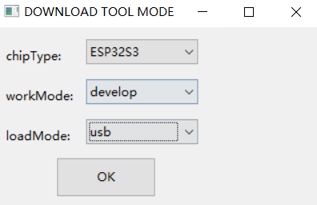
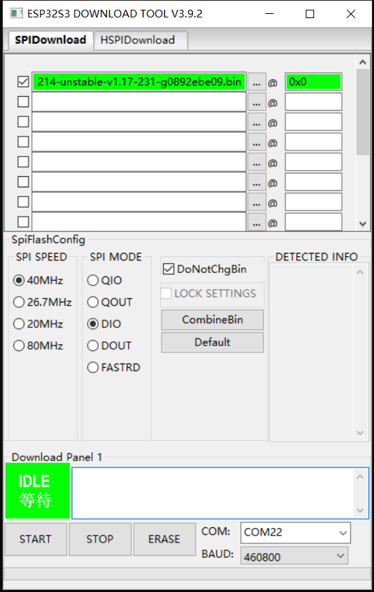

# Micropython 固件下载与烧录

在[MicroPython官网](https://micropython.org/)可以找到支持ESP32S3芯片的固件 https://micropython.org/download/GENERIC_S3/

点击连接进入页面后即可在下方看到几个固件的下载地址，选择一个.bin 后缀的文件下载到本地即可。


注意固件名中标注的日期，离当前时间越近的功能越新。

可以用两种工具来烧录固件，乐鑫科技官方的FLASH下载工具或esptool ，二选其一即可。

## 设置固件下载模式

有两种操作方法：

1.通过USB连接到电脑，按住BOOT键，再按一下RESET键并松开，最后松开BOOT键。

2.在断开供电的条件下按住BOOT键，再通过USB连接到电脑，最后松开BOOT键。

由此可知，芯片是通过BOOT键所控制的GPIO0来选择复位或重新上电时的启动模式。

在设备管理器中确认COM接口，固件下载模式与普通模式下的com接口序号通常是不一样的。


## Windows FLASH下载工具

下载并解压：[FLASH下载工具下载地址](https://www.espressif.com/zh-hans/support/download/other-tools)

打开软件并选择芯片型号为ESP32S3,将下载模式设置为usb：



此时需要设置开发板为固件下载模式。

在芯片处于固件下载模式的条件下，在FLASH下载工具窗口中修改COM接口为对应的接口，此处为COM22。

添加MicroPython固件，对于ESP32-S3芯片要设置flash起始地址为 `0x0000` 。



先点击ERASE按钮清除flash上的数据，再点击START烧写固件到flash中。

烧录完成后按一次RESET键，使开发板进入普通使用模式。

## esptool

以Windows PowerShell的具体操作步骤为例。

使用以下命令安装esptool：

```shell
pip install esptool
```

如果未来有需要，则可以使用以下命令升级esptool：

```shell
pip install -U esptool
```

通过命令或其他方法在PowerShell中进入固件所在的目录。

可以在Windows文件夹窗口中以按住shift键再单击右键的方式在此文件夹中打开PowerShell窗口。

此时需要设置开发板为固件下载模式，详见上文。

通过以下命令清除flash，需要修改COM接口为对应的接口，此处为COM22。

```shell
python -m esptool --chip esp32s3 --port COM1 erase_flash
```

通过以下命令烧录固件，需要修改固件文件名为当前对应需要烧录的文件名。

```shell
python -m esptool --chip esp32s3 --port COM1 --baud 460800 --before=usb_reset --after=no_reset write_flash 0x0 GENERIC_S3_SPIRAM-20220618-v1.19.1.bin
```

如果是通过USB烧录，完成后按一次RESET键复位，使开发板进入普通使用模式。

如果是通过UART烧录，则会在完成后自动复位。