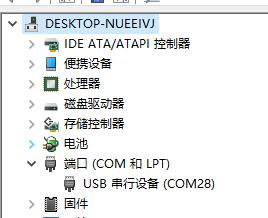
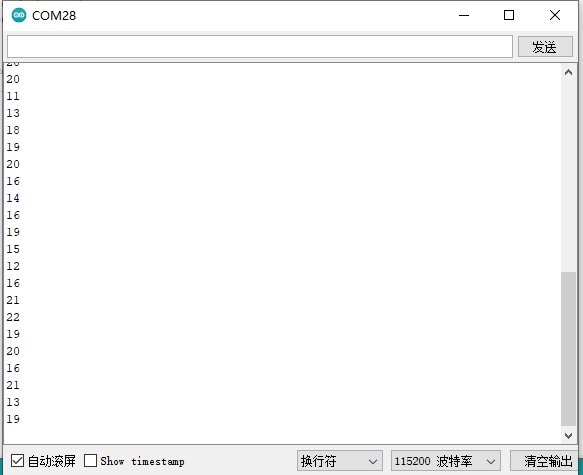
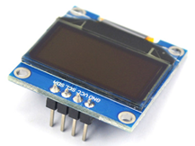

# 板載資源的使用

本章主要是通過一些示例項目，闡述 Leaf-S3 主控板的外設基本使用方法，通過下面的項目，您可以進行修改完成您的自己的項目。
其中 Leaf-S3 外設主要包括：UART、I2C、SPI、ADC、PWM、DAC等。

## 開始之前的準備

BPI-Leaf-S3 開發板上的typec使用的是ESP32-S3的原生USB接口，而不是傳統的USB轉TLL芯片。

為了讓您的開發板能正確下載程序，您需要將BPI-Leaf-S3設置為下載模式，有以下兩種方法：

- 通過USB連接到電腦，按下BOOT鍵，再按一下Reset鍵並鬆開，最後鬆開BOOT鍵。

- 在斷開所有供電的狀態下，按住BOOT鍵，然後將開發板插上電腦，最後鬆開BOOT鍵。

這時候可以在設備管理器中看到一個多的COM口



在IDE中選擇這個端口


## 項目一 串口實驗

在最開始的章節中，我們上傳了一個 Blink 閃爍程序來測試板子上的 LED 狀態燈。現在，我們使用 UART 串口，每秒打印一次計時數據。

### 所需元件

Leaf-S3 主板 X 1


### 硬件連接 

此項目不需要其他傳感器，所以只需要把Leaf-S3用USB連到電腦就能用。

### 輸入代碼 

打開 Arduino IDE。儘管可以直接複製代碼，我們還是建議您自己手動輸入代碼熟悉下。

代碼如下:  

<details>
<summary>展開查看</summary>

```
void setup() 
{
  Serial.begin(115200);         //設置串口通信波特率
} 
void loop() 
{
  static unsigned long i = 0;   //定義變量i
  Serial.println(i++);          //i加一後輸出i
  delay(1000);                  //延時1秒
} 

```
</details>

輸入完成後，點擊“編譯”檢查代碼有無錯誤。確保沒有錯誤後就可以開始上傳了，點擊“上傳”之後 IDE 會把代碼發送給 Leaf-S3 主板。上傳完成之後，你需要按一下復位鍵，這樣代碼就能正常運行了

### 實驗現象

完成之前步驟的上傳後，打開 Arduino IDE 自帶的串口監視器，可以看到如下的打印信息： 



## 項目二 PWM(呼吸燈)

呼吸燈，即讓 Leaf-S3 通過 PWM 驅動 LED 燈，實現 LED 的亮度漸變，看起來就像是在呼吸一樣。關於 PWM 的解釋，請閱覽知識擴展部分。

### 所需元件

Leaf-S3 主板 X 1


LED X 1 (建議串聯一個電阻限流)


### 硬件連接

將LED連接到Leaf-S3的GPIO13就可以了，長的那個腳接GPIO13，短的接到GND

### 輸入代碼 

打開 Arduino IDE。儘管可以直接複製代碼，我們還是建議您自己手動輸入代碼熟悉下。
代碼如下: 

<details>
<summary>展開查看</summary>

```
#define LED_CHANNEL_0     0    //設置通道0 
#define LED_TIMER_13_BIT  13   //設置13位定時器
#define LED_BASE_FREQ     5000 //設置定時器頻率位5000Hz 
#define LED_PIN            13  //設置LED燈 

int brightness = 0;    // LED亮度
int fadeAmount = 1;    // LED數量
 
//設置led燈的亮度 
void ledcAnalogWrite(uint32_t value, uint32_t valueMax = 255) { 
  //計算佔空比 
  uint32_t duty = (LED_BASE_FREQ / valueMax) * min(value, valueMax); 
  //設置佔空比 
  ledcWrite(LED_CHANNEL_0, duty); 
}  
void setup() { 
  ledcSetup(LED_CHANNEL_0, LED_BASE_FREQ, LED_TIMER_13_BIT);   ledcAttachPin(LED_PIN, LED_CHANNEL_0); 
}  
void loop() { 
  ledcAnalogWrite(brightness);   brightness += fadeAmount; 
 
  if (brightness <= 0 || brightness >= 255) { 
       fadeAmount = -fadeAmount; 
  }   
  delay(30); 
}

```
</details>

輸入完成後，點擊“編譯”按鈕檢查代碼是否有錯誤。確定沒有錯誤後可以開始上傳了，點擊“上傳”按鈕 。 IDE 會把代碼發送給 Leaf-S3 主板。上傳完成後您就可以看見Type-C旁邊的LED 燈開始“呼吸”了！
現在讓我們來回顧一下代碼和硬件，看看它是如何工作。

### 知識學習

什麼是 PWM 控制信號？

PWM（pulse-width modulation）脈衝寬度調製，MCU（微控制器）通過對開關器件的通斷進行控制，使輸出端得到一系列幅值相等的脈衝，用這些脈衝來代替正弦波或所需的波形。如下圖所示：


其中，tON 是高電平持續時間，tPWM 是 PWM 波的周期，tPWM-tON 是低電平持續時間，佔空比是指高電平持續時間佔整個週期的比例，即 D=ton/tPWM 。

### 代碼分析

Leaf-S3 的 PWM 比普通的 Arduino UNO 高級的多，設置上不能簡單的使用analogWrite 函數來驅動 PWM，而是需要設置 timer 函數，以及相關的頻率參數等才能工作。

```
#define LEDC_CHANNEL_0     0
```

定義了定時器使用的通道，Leaf-S3 總共有 16 個通道，這裡用的是通道 0。

```
#define LEDC_TIMER_13_BIT  13
```

定義了定時器為 13 位定時器，即定時器最大計數為 2 的 13 次方。

```
#define LEDC_BASE_FREQ     5000
```

這是設置定時器的頻率，單位是 Hz。接下來的 brightness 和 fadeAmount 參數分別表示 PWM 的佔空比和每次變化的數值。

```
void ledcAnalogWrite(uint32_t value, uint32_t valueMax = 255)
```

這個函數是計算 PWM 佔空比和設置 PWM 佔空比，類似 Arduino 的 analogWrite 函數，可以看到，傳遞參數的最大值是 255，這是為了和 analogWrite 兼容。

```
ledcSetup(LEDC_CHANNEL_0, LEDC_BASE_FREQ, LEDC_TIMER_13_BIT); 
	       ledcAttachPin(LED_PIN, LEDC_CHANNEL_0);
```

這兩個函數是 Leaf-S3 定時器設置函數，函數原型及原理這裡不講述，如果您感興趣可以看看底層源碼（源碼地址：C:\Users\“your-PC”\AppData\Local\Arduino15\packages\esp32\ hardware\ adafruit_metro_esp32s2 \0.0.3\libraries\ESP32\），這裡只需要知道怎麼用這些函數來設置相關的 timer 就可以了。

關於什麼是 PWM 信號，在前面已經闡述過了，這裡不再說明。

>注意：Leaf-S3 的任何引腳都可以配置成 PWM 輸出，您可以嘗試著修改代碼，完成您的項目。

## 項目三 ADC 

ADC（模數轉換器即 A/D 轉換器），是指將模擬信號轉變成數字信號。 Leaf-S3 的ADC 是13位的，最大輸出值為 8191，而 Arduino UNO 是 10 位的，最大輸出值是 1023，因此，在精度上比Arduino UNO 要高，而且轉換速率快，且在使用上兼容 Arduino analogRead 函數，直接讀取即可。

### 所需元件 

模擬角度傳感器 X 1


麵包板 X 1


Leaf-S3 主板 X 1


### 硬件連接 

 把 電位計插接到 Leaf-S3 主板上，然後將模擬角度傳感器插接到 IO2（實驗中用的是IO2）。元件連接好後，使用 USB 線連接 Leaf-S3 和電腦。

 ### 輸入代碼

 打開 Arduino IDE。儘管可以直接複製代碼，我們還是建議您自己手動輸入代碼熟悉下。代碼如下: 

<details>
<summary>展開查看</summary>

```
 void setup() { 
  // put your setup code here, to run once: 
  Serial.begin(115200); 
}  
void loop() { 
  // put your main code here, to run repeatedly:   
  Serial.println(analogRead(2));  
  delay(100); 
}

```
</details>

 輸入完成後，點擊“編譯”檢查代碼有無錯誤。確保沒有錯誤後就可以開始上傳了，點擊“上傳”之後IDE 會把代碼發送給 Leaf-S3 主板。上傳完成後，打開 Arduino IDE 的串口監視器，旋轉模擬角度傳感器，可以看到串口監視器中的數值變化，如下圖所示：

 


### 代碼分析

由於Leaf-S3 的 ADC 在使用上完全兼容 Arduino，因此這裡不再對analogRead 函數進行過多的講解。
 
注意：如果您對 Arduino 的基本函數不是特別熟悉，您可以[點擊鏈接](https://www.arduino.cc/en/Tutorial/BuiltInExamples)進行學習。

## 項目四 I2C

Leaf-S3 的 I2C 可以配置到任意 I/O 口，您可以通過傳遞相關參數進行配置。為了方便使用，我們已經將 I2C 進行了默認配置，在使用上完全兼容 Arduino，默認配置引腳可以在第一章簡介中查看到。本項目是基於 I2C 默認配置，驅動 OLED 顯示屏。

所需元件

I2C OLED-12864 顯示屏 X 1 



麵包板
X 1


Leaf-S3 主板 X 1


### 硬件連接

把Leaf-S3 主板插到麵包板上，然後將 OLED顯示屏插接到 I2C 接口。 （SDA是33，SCL是34）元件連接好後，使用 USB 線連接 Leaf-S3 和電腦。

### 輸入代碼 

打開 Arduino IDE。儘管可以直接複製代碼，我們還是建議您自己手動輸入代碼熟悉下。代碼如下:

<details>
<summary>展開查看</summary>

```
#include <Wire.h> 
   int UG2864Address = 0x3C;//OLED UG2864器件7位地址 
 
prog_char F8X16[][16] PROGMEM =
{
  0x00,0x00,0x00,0x00,0x00,0x00,0x00,0x00,0x00,0x00,0x00,0x00,0x00,0x00,0x00,0x00,// 0
  0x00,0x00,0x00,0xF8,0x00,0x00,0x00,0x00,0x00,0x00,0x00,0x33,0x30,0x00,0x00,0x00,//!1
  0x00,0x10,0x0C,0x06,0x10,0x0C,0x06,0x00,0x00,0x00,0x00,0x00,0x00,0x00,0x00,0x00,//"2
  0x40,0xC0,0x78,0x40,0xC0,0x78,0x40,0x00,0x04,0x3F,0x04,0x04,0x3F,0x04,0x04,0x00,//#3
  0x00,0x70,0x88,0xFC,0x08,0x30,0x00,0x00,0x00,0x18,0x20,0xFF,0x21,0x1E,0x00,0x00,//$4
  0xF0,0x08,0xF0,0x00,0xE0,0x18,0x00,0x00,0x00,0x21,0x1C,0x03,0x1E,0x21,0x1E,0x00,//%5
  0x00,0xF0,0x08,0x88,0x70,0x00,0x00,0x00,0x1E,0x21,0x23,0x24,0x19,0x27,0x21,0x10,//&6
  0x10,0x16,0x0E,0x00,0x00,0x00,0x00,0x00,0x00,0x00,0x00,0x00,0x00,0x00,0x00,0x00,//'7
  0x00,0x00,0x00,0xE0,0x18,0x04,0x02,0x00,0x00,0x00,0x00,0x07,0x18,0x20,0x40,0x00,//(8
  0x00,0x02,0x04,0x18,0xE0,0x00,0x00,0x00,0x00,0x40,0x20,0x18,0x07,0x00,0x00,0x00,//)9
  0x40,0x40,0x80,0xF0,0x80,0x40,0x40,0x00,0x02,0x02,0x01,0x0F,0x01,0x02,0x02,0x00,//*10
  0x00,0x00,0x00,0xF0,0x00,0x00,0x00,0x00,0x01,0x01,0x01,0x1F,0x01,0x01,0x01,0x00,//+11
  0x00,0x00,0x00,0x00,0x00,0x00,0x00,0x00,0x80,0xB0,0x70,0x00,0x00,0x00,0x00,0x00,//,12
  0x00,0x00,0x00,0x00,0x00,0x00,0x00,0x00,0x00,0x01,0x01,0x01,0x01,0x01,0x01,0x01,//-13
  0x00,0x00,0x00,0x00,0x00,0x00,0x00,0x00,0x00,0x30,0x30,0x00,0x00,0x00,0x00,0x00,//.14
  0x00,0x00,0x00,0x00,0x80,0x60,0x18,0x04,0x00,0x60,0x18,0x06,0x01,0x00,0x00,0x00,///15
  0x00,0xE0,0x10,0x08,0x08,0x10,0xE0,0x00,0x00,0x0F,0x10,0x20,0x20,0x10,0x0F,0x00,//016
  0x00,0x10,0x10,0xF8,0x00,0x00,0x00,0x00,0x00,0x20,0x20,0x3F,0x20,0x20,0x00,0x00,//117
  0x00,0x70,0x08,0x08,0x08,0x88,0x70,0x00,0x00,0x30,0x28,0x24,0x22,0x21,0x30,0x00,//218
  0x00,0x30,0x08,0x88,0x88,0x48,0x30,0x00,0x00,0x18,0x20,0x20,0x20,0x11,0x0E,0x00,//319
  0x00,0x00,0xC0,0x20,0x10,0xF8,0x00,0x00,0x00,0x07,0x04,0x24,0x24,0x3F,0x24,0x00,//420
  0x00,0xF8,0x08,0x88,0x88,0x08,0x08,0x00,0x00,0x19,0x21,0x20,0x20,0x11,0x0E,0x00,//521
  0x00,0xE0,0x10,0x88,0x88,0x18,0x00,0x00,0x00,0x0F,0x11,0x20,0x20,0x11,0x0E,0x00,//622
  0x00,0x38,0x08,0x08,0xC8,0x38,0x08,0x00,0x00,0x00,0x00,0x3F,0x00,0x00,0x00,0x00,//723
  0x00,0x70,0x88,0x08,0x08,0x88,0x70,0x00,0x00,0x1C,0x22,0x21,0x21,0x22,0x1C,0x00,//824
  0x00,0xE0,0x10,0x08,0x08,0x10,0xE0,0x00,0x00,0x00,0x31,0x22,0x22,0x11,0x0F,0x00,//925
  0x00,0x00,0x00,0xC0,0xC0,0x00,0x00,0x00,0x00,0x00,0x00,0x30,0x30,0x00,0x00,0x00,//:26
  0x00,0x00,0x00,0x80,0x00,0x00,0x00,0x00,0x00,0x00,0x80,0x60,0x00,0x00,0x00,0x00,//;27
  0x00,0x00,0x80,0x40,0x20,0x10,0x08,0x00,0x00,0x01,0x02,0x04,0x08,0x10,0x20,0x00,//<28
  0x40,0x40,0x40,0x40,0x40,0x40,0x40,0x00,0x04,0x04,0x04,0x04,0x04,0x04,0x04,0x00,//=29
  0x00,0x08,0x10,0x20,0x40,0x80,0x00,0x00,0x00,0x20,0x10,0x08,0x04,0x02,0x01,0x00,//>30
  0x00,0x70,0x48,0x08,0x08,0x08,0xF0,0x00,0x00,0x00,0x00,0x30,0x36,0x01,0x00,0x00,//?31
  0xC0,0x30,0xC8,0x28,0xE8,0x10,0xE0,0x00,0x07,0x18,0x27,0x24,0x23,0x14,0x0B,0x00,//@32
  0x00,0x00,0xC0,0x38,0xE0,0x00,0x00,0x00,0x20,0x3C,0x23,0x02,0x02,0x27,0x38,0x20,//A33
  0x08,0xF8,0x88,0x88,0x88,0x70,0x00,0x00,0x20,0x3F,0x20,0x20,0x20,0x11,0x0E,0x00,//B34
  0xC0,0x30,0x08,0x08,0x08,0x08,0x38,0x00,0x07,0x18,0x20,0x20,0x20,0x10,0x08,0x00,//C35
  0x08,0xF8,0x08,0x08,0x08,0x10,0xE0,0x00,0x20,0x3F,0x20,0x20,0x20,0x10,0x0F,0x00,//D36
  0x08,0xF8,0x88,0x88,0xE8,0x08,0x10,0x00,0x20,0x3F,0x20,0x20,0x23,0x20,0x18,0x00,//E37
  0x08,0xF8,0x88,0x88,0xE8,0x08,0x10,0x00,0x20,0x3F,0x20,0x00,0x03,0x00,0x00,0x00,//F38
  0xC0,0x30,0x08,0x08,0x08,0x38,0x00,0x00,0x07,0x18,0x20,0x20,0x22,0x1E,0x02,0x00,//G39
  0x08,0xF8,0x08,0x00,0x00,0x08,0xF8,0x08,0x20,0x3F,0x21,0x01,0x01,0x21,0x3F,0x20,//H40
  0x00,0x08,0x08,0xF8,0x08,0x08,0x00,0x00,0x00,0x20,0x20,0x3F,0x20,0x20,0x00,0x00,//I41
  0x00,0x00,0x08,0x08,0xF8,0x08,0x08,0x00,0xC0,0x80,0x80,0x80,0x7F,0x00,0x00,0x00,//J42
  0x08,0xF8,0x88,0xC0,0x28,0x18,0x08,0x00,0x20,0x3F,0x20,0x01,0x26,0x38,0x20,0x00,//K43
  0x08,0xF8,0x08,0x00,0x00,0x00,0x00,0x00,0x20,0x3F,0x20,0x20,0x20,0x20,0x30,0x00,//L44
  0x08,0xF8,0xF8,0x00,0xF8,0xF8,0x08,0x00,0x20,0x3F,0x00,0x3F,0x00,0x3F,0x20,0x00,//M45
  0x08,0xF8,0x30,0xC0,0x00,0x08,0xF8,0x08,0x20,0x3F,0x20,0x00,0x07,0x18,0x3F,0x00,//N46
  0xE0,0x10,0x08,0x08,0x08,0x10,0xE0,0x00,0x0F,0x10,0x20,0x20,0x20,0x10,0x0F,0x00,//O47
  0x08,0xF8,0x08,0x08,0x08,0x08,0xF0,0x00,0x20,0x3F,0x21,0x01,0x01,0x01,0x00,0x00,//P48
  0xE0,0x10,0x08,0x08,0x08,0x10,0xE0,0x00,0x0F,0x18,0x24,0x24,0x38,0x50,0x4F,0x00,//Q49
  0x08,0xF8,0x88,0x88,0x88,0x88,0x70,0x00,0x20,0x3F,0x20,0x00,0x03,0x0C,0x30,0x20,//R50
  0x00,0x70,0x88,0x08,0x08,0x08,0x38,0x00,0x00,0x38,0x20,0x21,0x21,0x22,0x1C,0x00,//S51
  0x18,0x08,0x08,0xF8,0x08,0x08,0x18,0x00,0x00,0x00,0x20,0x3F,0x20,0x00,0x00,0x00,//T52
  0x08,0xF8,0x08,0x00,0x00,0x08,0xF8,0x08,0x00,0x1F,0x20,0x20,0x20,0x20,0x1F,0x00,//U53
  0x08,0x78,0x88,0x00,0x00,0xC8,0x38,0x08,0x00,0x00,0x07,0x38,0x0E,0x01,0x00,0x00,//V54
  0xF8,0x08,0x00,0xF8,0x00,0x08,0xF8,0x00,0x03,0x3C,0x07,0x00,0x07,0x3C,0x03,0x00,//W55
  0x08,0x18,0x68,0x80,0x80,0x68,0x18,0x08,0x20,0x30,0x2C,0x03,0x03,0x2C,0x30,0x20,//X56
  0x08,0x38,0xC8,0x00,0xC8,0x38,0x08,0x00,0x00,0x00,0x20,0x3F,0x20,0x00,0x00,0x00,//Y57
  0x10,0x08,0x08,0x08,0xC8,0x38,0x08,0x00,0x20,0x38,0x26,0x21,0x20,0x20,0x18,0x00,//Z58
  0x00,0x00,0x00,0xFE,0x02,0x02,0x02,0x00,0x00,0x00,0x00,0x7F,0x40,0x40,0x40,0x00,//[59
  0x00,0x0C,0x30,0xC0,0x00,0x00,0x00,0x00,0x00,0x00,0x00,0x01,0x06,0x38,0xC0,0x00,//\60
  0x00,0x02,0x02,0x02,0xFE,0x00,0x00,0x00,0x00,0x40,0x40,0x40,0x7F,0x00,0x00,0x00,//]61
  0x00,0x00,0x04,0x02,0x02,0x02,0x04,0x00,0x00,0x00,0x00,0x00,0x00,0x00,0x00,0x00,//^62
  0x00,0x00,0x00,0x00,0x00,0x00,0x00,0x00,0x80,0x80,0x80,0x80,0x80,0x80,0x80,0x80,//_63
  0x00,0x02,0x02,0x04,0x00,0x00,0x00,0x00,0x00,0x00,0x00,0x00,0x00,0x00,0x00,0x00,//`64
  0x00,0x00,0x80,0x80,0x80,0x80,0x00,0x00,0x00,0x19,0x24,0x22,0x22,0x22,0x3F,0x20,//a65
  0x08,0xF8,0x00,0x80,0x80,0x00,0x00,0x00,0x00,0x3F,0x11,0x20,0x20,0x11,0x0E,0x00,//b66
  0x00,0x00,0x00,0x80,0x80,0x80,0x00,0x00,0x00,0x0E,0x11,0x20,0x20,0x20,0x11,0x00,//c67
  0x00,0x00,0x00,0x80,0x80,0x88,0xF8,0x00,0x00,0x0E,0x11,0x20,0x20,0x10,0x3F,0x20,//d68
  0x00,0x00,0x80,0x80,0x80,0x80,0x00,0x00,0x00,0x1F,0x22,0x22,0x22,0x22,0x13,0x00,//e69
  0x00,0x80,0x80,0xF0,0x88,0x88,0x88,0x18,0x00,0x20,0x20,0x3F,0x20,0x20,0x00,0x00,//f70
  0x00,0x00,0x80,0x80,0x80,0x80,0x80,0x00,0x00,0x6B,0x94,0x94,0x94,0x93,0x60,0x00,//g71
  0x08,0xF8,0x00,0x80,0x80,0x80,0x00,0x00,0x20,0x3F,0x21,0x00,0x00,0x20,0x3F,0x20,//h72
  0x00,0x80,0x98,0x98,0x00,0x00,0x00,0x00,0x00,0x20,0x20,0x3F,0x20,0x20,0x00,0x00,//i73
  0x00,0x00,0x00,0x80,0x98,0x98,0x00,0x00,0x00,0xC0,0x80,0x80,0x80,0x7F,0x00,0x00,//j74
  0x08,0xF8,0x00,0x00,0x80,0x80,0x80,0x00,0x20,0x3F,0x24,0x02,0x2D,0x30,0x20,0x00,//k75
  0x00,0x08,0x08,0xF8,0x00,0x00,0x00,0x00,0x00,0x20,0x20,0x3F,0x20,0x20,0x00,0x00,//l76
  0x80,0x80,0x80,0x80,0x80,0x80,0x80,0x00,0x20,0x3F,0x20,0x00,0x3F,0x20,0x00,0x3F,//m77
  0x80,0x80,0x00,0x80,0x80,0x80,0x00,0x00,0x20,0x3F,0x21,0x00,0x00,0x20,0x3F,0x20,//n78
  0x00,0x00,0x80,0x80,0x80,0x80,0x00,0x00,0x00,0x1F,0x20,0x20,0x20,0x20,0x1F,0x00,//o79
  0x80,0x80,0x00,0x80,0x80,0x00,0x00,0x00,0x80,0xFF,0xA1,0x20,0x20,0x11,0x0E,0x00,//p80
  0x00,0x00,0x00,0x80,0x80,0x80,0x80,0x00,0x00,0x0E,0x11,0x20,0x20,0xA0,0xFF,0x80,//q81
  0x80,0x80,0x80,0x00,0x80,0x80,0x80,0x00,0x20,0x20,0x3F,0x21,0x20,0x00,0x01,0x00,//r82
  0x00,0x00,0x80,0x80,0x80,0x80,0x80,0x00,0x00,0x33,0x24,0x24,0x24,0x24,0x19,0x00,//s83
  0x00,0x80,0x80,0xE0,0x80,0x80,0x00,0x00,0x00,0x00,0x00,0x1F,0x20,0x20,0x00,0x00,//t84
  0x80,0x80,0x00,0x00,0x00,0x80,0x80,0x00,0x00,0x1F,0x20,0x20,0x20,0x10,0x3F,0x20,//u85
  0x80,0x80,0x80,0x00,0x00,0x80,0x80,0x80,0x00,0x01,0x0E,0x30,0x08,0x06,0x01,0x00,//v86
  0x80,0x80,0x00,0x80,0x00,0x80,0x80,0x80,0x0F,0x30,0x0C,0x03,0x0C,0x30,0x0F,0x00,//w87
  0x00,0x80,0x80,0x00,0x80,0x80,0x80,0x00,0x00,0x20,0x31,0x2E,0x0E,0x31,0x20,0x00,//x88
  0x80,0x80,0x80,0x00,0x00,0x80,0x80,0x80,0x80,0x81,0x8E,0x70,0x18,0x06,0x01,0x00,//y89
  0x00,0x80,0x80,0x80,0x80,0x80,0x80,0x00,0x00,0x21,0x30,0x2C,0x22,0x21,0x30,0x00,//z90
  0x00,0x00,0x00,0x00,0x80,0x7C,0x02,0x02,0x00,0x00,0x00,0x00,0x00,0x3F,0x40,0x40,//{91
  0x00,0x00,0x00,0x00,0xFF,0x00,0x00,0x00,0x00,0x00,0x00,0x00,0xFF,0x00,0x00,0x00,//|92
  0x00,0x02,0x02,0x7C,0x80,0x00,0x00,0x00,0x00,0x40,0x40,0x3F,0x00,0x00,0x00,0x00,//}93
  0x00,0x06,0x01,0x01,0x02,0x02,0x04,0x04,0x00,0x00,0x00,0x00,0x00,0x00,0x00,0x00,//~94
};
 
 
字符 ch_buf[17]={0};
int RES = 6;//小工具 PIN6
int DC = 7;//小工具 PIN3
 
void Writec(unsigned char COM)
{
  Wire.beginTransmission(UG2864地址);
  Wire.write(0x00);
  Wire.write(COM);
  Wire.endTransmission();
}
 
無效寫入（無符號字符數據）
{
  Wire.beginTransmission(UG2864地址);
  Wire.write(0x40);
  Wire.write(DATA);
  Wire.endTransmission();
}
 
無效 SSD1306()
{
  Writec(0XAE);//顯示關閉
  writec(0X00);//設置低列地址
  writec(0X10);//設置更高的列地址
  writec(0X40);//設置顯示起始行
  writec(0XB0);//設置頁面地址
  writec(0X81);//設置合約控制
  Writec(0XCF);// 內部 DC/DC 電路產生的 VCC
  writec(0XA0);//設置段重映射列地址127映射到SEG0
  writec(0XA6);//正常/反轉正常顯示
  writec(0XA8);//復用比
  寫c(0X3F);//1/64
  Writec(0XC0);//Com掃描方向重映射模式。從 COM[N-1] 掃描到 COM0
  writec(0XD3);//設置顯示偏移
  寫c(0X00);
  writec(0XD5);//設置osc除法
  寫c（0X80）；
  writec(0XD9);//設置預充電週期
  寫c（0X11）；
  Writec(0XDa);//設置 COM 引腳
  寫c（0X12）；
  Writec(0X8d);/*設置電荷泵使能*/
  寫c（0X14）；
  Writec(0Xdb);//設置VcomH
  寫c(0X20);
  寫c(0XAF);//display ON
}
void fill(unsigned char dat)
{
  unsigned char i,j;
  
  Writec(0x00);//set lower column address
  Writec(0x10);//set higher column address
  Writec(0xB0);//set page address
  
  for(j=0;j<8;j++)
  {
    Writec(0xB0+j);//set page address
    Writec(0x00);//set lower column address
    Writec(0x10);//set higher column address
    for(i=0;i<128;i++)
    {
      Writed(dat);
    }
  }
}
 
void show_string(unsigned char x,unsigned char y,char *s)
{
  unsigned char i,j,lower,higher;
  char *t;
  t=s;
  lower=y%16;
  higher=y/16;
  if((x>3) || (y>120))
    return;
  Writec(0xB0+x*2);//set page address
  Writec(lower);//set lower column address
  Writec(0x10+higher);//set higher column address
  for(j=0;*s!='\0';j++)
  {
    
    for(i=0;i<8;i++){
      ch_buf[i] = pgm_read_word(&F8X16[*s-32][i]);
    }
    for(i=0;i<8;i++)
      Writed(ch_buf[i]);
    s++;
  }
  Writec(0xB0+x*2+1);//set page address
  Writec(lower);//set lower column address
  Writec(0x10+higher);//set higher column address
  s=t;
  for(j=0;*s!='\0';j++)
  {
    for(i=0;i<8;i++){
      ch_buf[i] = pgm_read_word(&F8X16[*s-32][i+8]);
    }
    for(i=0;i<8;i++)
      Writed(ch_buf[i]);
    s++;
  }
}
 
 
 
void oled_init(void)
{
  pinMode(RES,OUTPUT);//RES
  pinMode(DC,OUTPUT);//D/C#
  
  digitalWrite(DC,LOW);
  Wire.begin();
  digitalWrite(RES,HIGH);   delay(100);
  digitalWrite(RES,LOW);    delay(100);
  digitalWrite(RES,HIGH);   delay(100);
  SSD1306();
  fill(0x00);
}
 
void setup() {
  oled_init();
}
 
 
void loop()
{
      fill(0x00);
      show_string(0,12,"BananaPi");
 
      show_string(2,12,"banana-pi.org");
      while(1);
}


```
</details>

输入完成后，点击“编译”检查代码有无错误。确保没有错误后就可以开始上传了，点击“上传”之后 IDE  	会把代码发送给 Leaf-S3 主板。上传完成后，OLED 显示屏会显示“BananaPi banana-pi.org”字样。

### 代码分析

本项目的代码相对于前面的项目较多，主要是基于 I2C 通信对 OLED 显示屏底层寄存器的直接驱动。

```
void Writec(unsigned char COM)
```

设置寄存器函数，通过 I2C 对 OLED 显示屏设置，I2C 使用方法完全兼容 Arduino。 

```
void Writed(unsigned char DATA)
```

写数据函数，I2C 使用方法完全兼容 Arduino。 

>注意：Leaf-S3 的 I2C 与 Arduino 完全兼容，主要是调用 Wire 库文件使用。

## 项目五 SPI

在很多传感器中，都使用 SPI 通信，因为 SPI 通信速率相对于 I2C 更快，没有地址冲突的弊端。SPI，是  一种高速的、全双工、同步的通信总线，而 Leaf-S3 的 SPI 可以配置到所有 I/O，您可以阅览底层  代码进行使用（初学者不建议使用）。为了更好的使用体验，Leaf-S3 默认情况下配置了IO35、IO36、IO37 为 SPI 口，在使用上则完全兼容 Arduino。 本项目使用 Leaf-S3，通过 SPI 读取 BME280 温湿度传感器的数据，示例中使用的是BME280 库文件，关于 SPI 驱动您可以阅览 BEM280 库文件，[点击链接](https://github.com/DFRobot/DFRobot_BME280)下载 BME280 库文件。 

### 所需元件 

BME280 温湿度传感器 X 1


>注意：BME280 传感器本身支持 I2C 和 SPI 通信，这里我们采用 SPI 通信。 

面包板 X 1


Leaf-S3 主板 X 1


### 输入代码

打开 Arduino IDE。尽管可以直接复制代码，我们还是建议您自己手动输入代码熟悉下。 （这个程序需要DFRobot_BME280库，需要在[GitHub](https://github.com/DFRobot/DFRobot_BME280)下载，解压到Arduino\ Library 文件夹下 ）代码如下：

<details>
<summary>展开查看</summary>

```
/*!
 * read_data_spi.ino
 *
 * Download this demo to test read data from bme280, connect sensor through spi interface
 * Connect cs pin to io 2
 * Data will print on your serial monitor
 *
 * Copyright   [DFRobot](http://www.dfrobot.com), 2016
 * Copyright   GNU Lesser General Public License
 *
 * version  V1.0
 * date  12/03/2019
 */

#include "DFRobot_BME280.h"
#include "Wire.h"

typedef DFRobot_BME280_SPI    BME;    // ******** use abbreviations instead of full names ********

# define PIN_CS   2

BME   bme(&SPI, PIN_CS);   // select TwoWire peripheral and set cs pin id

#define SEA_LEVEL_PRESSURE    1015.0f

// show last sensor operate status
void printLastOperateStatus(BME::eStatus_t eStatus)
{
  switch(eStatus) {
  case BME::eStatusOK:    Serial.println("everything ok"); break;
  case BME::eStatusErr:   Serial.println("unknow error"); break;
  case BME::eStatusErrDeviceNotDetected:    Serial.println("device not detected"); break;
  case BME::eStatusErrParameter:    Serial.println("parameter error"); break;
  default: Serial.println("unknow status"); break;
  }
}

void setup()
{
  Serial.begin(115200);
  bme.reset();
  Serial.println("bme read data test");
  while(bme.begin() != BME::eStatusOK) {
    Serial.println("bme begin faild");
    printLastOperateStatus(bme.lastOperateStatus);
    delay(2000);
  }
  Serial.println("bme begin success");
  delay(100);
}

void loop()
{
  float   temp = bme.getTemperature();
  uint32_t    press = bme.getPressure();
  float   alti = bme.calAltitude(SEA_LEVEL_PRESSURE, press);
  float   humi = bme.getHumidity();

  Serial.println();
  Serial.println("======== start print ========");
  Serial.print("temperature (unit Celsius): "); Serial.println(temp);
  Serial.print("pressure (unit pa):         "); Serial.println(press);
  Serial.print("altitude (unit meter):      "); Serial.println(alti);
  Serial.print("humidity (unit percent):    "); Serial.println(humi);
  Serial.println("========  end print  ========");

  delay(1000);
}


```
</details>

 输入完成后，点击“编译”检查代码有无错误。确保没有错误后就可以开始上传了，点击“上传”之后 IDE  会把代码发送给 Leaf-S3 主板。打开 Arduino 串口监视器，可以看到打印信息如下： 


### 代码分析

 本项目採用的是 BME280 庫文件，在 Item-5.ino 文件中並沒有對 SPI 底層進行操作，不過，Leaf  ESP32-S3 的 SPI 使用完全兼容 Arduino。

## 項目六 WS2812

 Leaf-S3 集成了一個型號為WS2812的RGB彩燈。本項目是點亮 Leaf-S3 的RGB彩燈的實驗，

### 所需元件

Leaf-S3 主板 X 1


>注意：該項目不需要連接其他傳感器。

### 輸入代碼

打開 Arduino IDE。儘管可以直接複製代碼，我們還是建議您自己手動輸入代碼熟悉下。 （這個程序需要Adafruit_NeoPixel庫，需要在[GitHub](https://github.com/adafruit/Adafruit_NeoPixel)下載，解壓到Arduino\ Library 文件夾下）代碼如下:

<details>
<summary>展開查看</summary>

```
// NeoPixel Ring simple sketch (c) 2013 Shae Erisson
// Released under the GPLv3 license to match the rest of the
// Adafruit NeoPixel library

#include <Adafruit_NeoPixel.h>
#ifdef __AVR__
 #include <avr/power.h> // Required for 16 MHz Adafruit Trinket
#endif

// Which pin on the Arduino is connected to the NeoPixels?
#define PIN        18 // On Trinket or Gemma, suggest changing this to 1

// How many NeoPixels are attached to the Arduino?
#define NUMPIXELS 1 // Popular NeoPixel ring size

// When setting up the NeoPixel library, we tell it how many pixels,
// and which pin to use to send signals. Note that for older NeoPixel
// strips you might need to change the third parameter -- see the
// strandtest example for more information on possible values.
Adafruit_NeoPixel pixels(NUMPIXELS, PIN, NEO_GRB + NEO_KHZ800);

#define DELAYVAL 500 // Time (in milliseconds) to pause between pixels

void setup() {
  // These lines are specifically to support the Adafruit Trinket 5V 16 MHz.
  // Any other board, you can remove this part (but no harm leaving it):
#if defined(__AVR_ATtiny85__) && (F_CPU == 16000000)
  clock_prescale_set(clock_div_1);
#endif
  // END of Trinket-specific code.

  pixels.begin(); // INITIALIZE NeoPixel strip object (REQUIRED)
}

void loop() {
  pixels.clear(); // Set all pixel colors to 'off'

  // The first NeoPixel in a strand is #0, second is 1, all the way up
  // to the count of pixels minus one.
  for(int i=0; i<NUMPIXELS; i++) { // For each pixel...

    // pixels.Color() takes RGB values, from 0,0,0 up to 255,255,255
    // Here we're using a moderately bright green color:
    pixels.setPixelColor(i, pixels.Color(0, 150, 0));

    pixels.show();   // Send the updated pixel colors to the hardware.

    delay(DELAYVAL); // Pause before next pass through loop
  }
}

```
</details>

輸入完成後，點擊“編譯”檢查代碼有無錯誤。確保沒有錯誤後就可以開始上傳了，點擊“上傳”之後 IDE  會把代碼發送給 Leaf-S3 主板。復位後WS2812燈會開始亮綠燈，

>注意：如果需要其他顏色，可以修改代碼中的RGB值。

### 代碼分析

本項目使用 Leaf-S3 集成的WS2812燈，默認GPIO是18。

```
#define PIN        18
```

設置GPIO引腳號

```
#define NUMPIXELS 1 
```

設置燈的個數，如果您想連接更多WS2812，可以換一個IO，並修改燈的數量。

## 項目七 DAC

DAC（數/模轉換器），與項目三的 ADC 恰恰相反，DAC 是將數字信號轉換成模擬信號輸出。 Leaf-S3 集成了兩個 8-bit DAC 通道，這兩個數字信號分別轉換為兩個模擬電壓信號輸出。 DAC 電路由  	內置電阻串和 1 個緩衝器組成。並且這兩個 DAC 可以作為參考電壓使用，也可以作為其他電路的電源使用，是兩個獨立的 DAC。本項目將闡述如何使用 DAC 輸出階梯波形。

### 所需元件

Leaf-S3 主板 X 1


>注意：該項目不需要連接其他傳感器。

### 輸入代碼

打開 Arduino IDE。儘管可以直接複製代碼，我們還是建議您自己手動輸入代碼熟悉下。代碼如下:


<details>
<summary>展開查看</summary>

```
void setup() { 
}  
void loop() { 
  // put your main code here, to run repeatedly: 
  for(int i=0;i<10;i++){     dacWrite(17,i*25);     delay(200); 
  } 
  for(int j=10;j>0;j--){     dacWrite(17,j*25);     delay(200); 
  } 
} 

```
</details>

輸入完成後，點擊“編譯”檢查代碼有無錯誤。確保沒有錯誤後就可以開始上傳了，點擊“上傳”之後 IDE  	會把代碼發送給 Leaf-S3 主板。用示波器測試 GPIO17 口的電壓，可以看到如下圖所示的階梯波形：


### 代碼分析

可以看到 Arduino 代碼中，使用 DAC 是很方便的，只需要調用 dacWrite 函數，函數原型如下： 

```
void dacWrite(uint8_t pin, uint8_t value) 
```

其中，pin 腳為輸出 DAC 的數字口，這裡只能傳遞 17 或者 18；value 是輸出的值，範圍是 0~255，輸出後對應的電壓值是 0~Vcc。

## 項目八 觸摸傳感器

Leaf-S3 提供了多達 10 個電容式傳感器 GPIO，能夠探測由手指或其他物品直接接觸或接近而產生的電容差異。這種低噪聲特性和電路的高靈敏度設計適用於較小的觸摸板，可以直接用於觸摸開關。本項目闡述瞭如何通過Arduino 代碼獲取 Leaf-S3 的觸摸傳感器狀態，並打印狀態。

### 所需元件

Leaf-S3 主板 X 1


>注意：該項目不需要連接其他傳感器。

### 輸入代碼

打開 Arduino IDE。儘管可以直接複製代碼，我們還是建議您自己手動輸入代碼熟悉下。

代碼如下:

<details>
<summary>展開查看</summary>

```
 void setup() 
{ 
  Serial.begin(115200); 
      delay(1000); // give me time to bring up serial monitor 
      Serial.println("Leaf-S3 Touch Test");    
}  
void loop(){ 
  Serial.println(touchRead(T2));  // get value using T0->D9  
  delay(100); 
} 

```
</details>

輸入完成後，點擊“編譯”檢查代碼有無錯誤。確保沒有錯誤後就可以開始上傳了，點擊“上傳”之後 IDE  會把代碼發送給 Leaf-S3 主板。打開 Arduino IDE 串口監視器，並用手觸摸 GPIO2（T2 對應的是GPIO2），可以看到會打印出的數據突然變小，如下圖所示： 


### 代碼分析

獲取觸摸傳感器的 GPIO 狀態，只需要調用 touchRead 函數，函數原型如下：

```
 uint16_t touchRead(uint8_t pin)
```

返回“0”表示沒有觸摸，“1”表示觸摸。其中 pin 是 T0~T9，對應到 Leaf 的引腳如下表所示：

<table>
   <tr>
      <td></td>
   </tr>
   <tr>
      <td>觸摸傳感器序號 </td>
      <td>對應的 ESP32 硬件 </td>
      <td>Leaf-S3</td>
      <td> </td>
   </tr>
   <tr>
      <td>T1</td>
      <td>GPIO1</td>
      <td>IO1</td>
   </tr>
   <tr>
      <td>T2 </td>
      <td>GPIO2 </td>
      <td>IO2</td>
   </tr>
   <tr>
      <td>T3 </td>
      <td>GPIO3</td>
      <td>IO3</td>
   </tr>
   <tr>
      <td>T4 </td>
      <td>GPIO4</td>
      <td>IO4</td>
   </tr>
   <tr>
      <td>T5 </td>
      <td>GPIO5</td><td>IO5</td>
    </tr>
    <tr>
       <td>T6 </td>
       <td>GPIO6</td>
       <td>IO6</td>
    </tr>
    <tr>
       <td>T7 </td>
       <td>GPIO7</td>
       <td>IO7</td>
    </tr>
    <tr>
       <td>T8 </td>
       <td>GPIO8</td>
       <td>IO8</td>
    </tr>
    <tr>
       <td>T9 </td>
       <td>GPIO9</td>
       <td>IO9</td>
    </tr>
    <tr>
       <td>T10</td>
       <td>GPIO10</td>
       <td>IO10</td>
    </tr>
    <tr>
       <td>T11</td>
       <td>GPIO11</td>
       <td>IO11</td>
    </tr>
    <tr>
       <td>T12</td>
       <td>GPIO12</td>
       <td>IO12</td>
    </tr>
    <tr>
       <td>T13</td>
       <td>GPIO13</td>
       <td>IO13</td>
    </tr>
    <tr>
       <td>T14</td>
       <td>GPIO14</td>
       <td>IO14</td>
    </tr>
    <tr>
       <td></td>
    </tr>
</table>