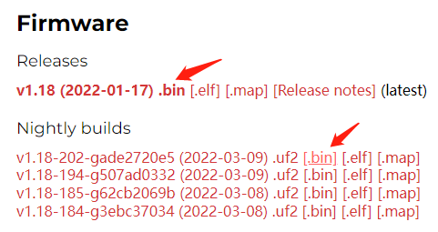
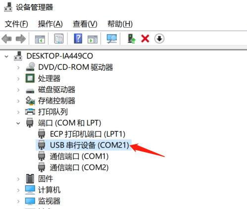

# Micropython 固件下載與燒錄

在[MicroPython官網](https://micropython.org/)可以找到支持ESP32S3芯片的固件 https://micropython.org/download/ESP32_GENERIC_S3/

點擊連接進入頁面後即可在下方看到幾個固件的下載地址，選擇一個.bin 後綴的文件下載到本地即可。



注意固件名中標註的日期，離當前時間越近的功能越新。

可以用兩種工具來燒錄固件，樂鑫科技官方的FLASH下載工具或esptool ，二選其一即可。

## 設置固件下載模式

有兩種操作方法：

1.通過USB連接到電腦，按住BOOT鍵，再按一下RESET鍵並鬆開，最後鬆開BOOT鍵。

2.在斷開供電的條件下按住BOOT鍵，再通過USB連接到電腦，最後鬆開BOOT鍵。

由此可知，芯片是通過BOOT鍵所控制的GPIO0來選擇復位或重新上電時的啟動模式。

在設備管理器中確認COM接口，固件下載模式與普通模式下的com接口序號通常是不一樣的。



## Windows FLASH下載工具

下載並解壓：[FLASH下載工具下載地址](https://www.espressif.com/zh-hans/support/download/other-tools)

打開軟件並選擇芯片型號為ESP32S3,將下載模式設置為usb：


此時需要設置開發板為固件下載模式。

在芯片處於固件下載模式的條件下，在FLASH下載工具窗口中修改COM接口為對應的接口，此處為COM22。

添加MicroPython固件，對於ESP32-S3芯片要設置flash起始地址為 `0x0000` 。


先點擊ERASE按鈕清除flash上的數據，再點擊START燒寫固件到flash中。

燒錄完成後按一次RESET鍵，使開發板進入普通使用模式。

## esptool

以Windows PowerShell的具體操作步驟為例。

使用以下命令安裝esptool：

```shell
pip install esptool
```

如果未來有需要，則可以使用以下命令升級esptool：

```shell
pip install -U esptool
```

通過命令或其他方法在PowerShell中進入固件所在的目錄。

可以在Windows文件夾窗口中以按住shift鍵再單擊右鍵的方式在此文件夾中打開PowerShell窗口。

此時需要設置開發板為固件下載模式，詳見上文。

通過以下命令清除flash，需要修改COM接口為對應的接口，此處為COM1。

```shell
python -m esptool --chip esp32s3 --port COM22 erase_flash
```

通過以下命令燒錄固件，需要修改固件文件名為當前對應需要燒錄的文件名。

```shell
python -m esptool --chip esp32s3 --port com22 --baud 460800 --before=default_reset --after=hard_reset write_flash -z 0x0 firmware_name.bin
```

如果是通過USB燒錄，完成後按一次RESET鍵復位，使開發板進入普通使用模式。

如果是通過UART燒錄，則會在完成後自動復位。