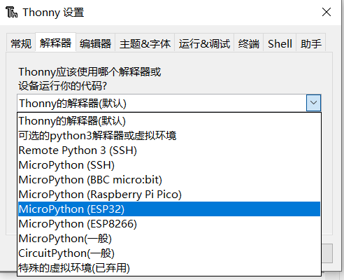

# Micropython 運行環境搭建

Micropython運行環境依賴於Python，所以在使用前我們需要先安裝Python，這裡我們使用的IDE是Thonny。

## 安裝Python環境

打開[Python官網](https://www.python.org/) 。

對於Windows 系統來說，最便捷的安裝包下載方法就是在官網首頁點擊如下圖所示的圖標進行下載。


其他操作系統或是其他發行版本則可以在 Downloads 選項欄中進行選擇。

建議使用python 3.7以上的版本。

開始安裝時一定要記得勾選Add Python 3.x to PATH，這樣可以免除再手動添加進PATH。


按照安裝提示逐步操作即可順利完成安裝 。

## 安裝Thonny IDE

以Windows PowerShell的具體操作步驟為例。

其他系統或安裝方法可參考[Thonny官網](https://thonny.org/)上的說明。

右鍵Windows開始菜單即可看到Windows PowerShell ，單擊打開。


我們在此處通過pip來安裝Thonny IDE。

pip是 Python 包管理工具，首先要確認pip是否是最新版，直接使用以下命令升級pip：

```shell
pip install -U pip
```

使用以下命令安裝Thonny：

```shell
pip install thonnyapp
```

如果未來有需要，則可以使用以下命令升級Thonny：

```shell
pip install -U thonnyapp
```

用Windows搜索即可快速找到Thonny，也可以在開始菜單欄裡找到它。


## 連接開發板至電腦

將開發板通過USB數據線連接至電腦。

正確連接時紅色LED會亮起。

我們需要知道開發板是否被電腦識別，並找出連接到了哪一個 COM 口（用於串口通信，下載程序等）。

首先在桌面找到“此電腦”,右鍵，選擇“管理”，打開“設備管理器”，點開“端口（COM 和 LPT）”。

此時會在列表中新加入一個 COM 口（示例圖中是 COM21）。


## 燒錄MicroPython固件

Leaf-S3開發板默認出廠固件是MicroPython，如果您需要燒錄固件，可以[參考這裡](Firmware.md)

## 配置Thonny IDE

打開Thonny，單擊 運行，單擊 選擇解釋器：


將解釋器設置為 MicroPython(ESP32)：



選擇開發板的COM口：


確認設置後，就在Shell中打開了MicroPython REPL。


REPL啟動並輸出信息即意味著MicroPython固件燒錄成功，可以開始正常使用了。

單擊 視圖，勾選 文件，即可看到本地文件目錄和開發板上的文件目錄：


其他視圖窗口也可按需設置使用。

在設置中可以選擇個人喜歡的主題風格。

