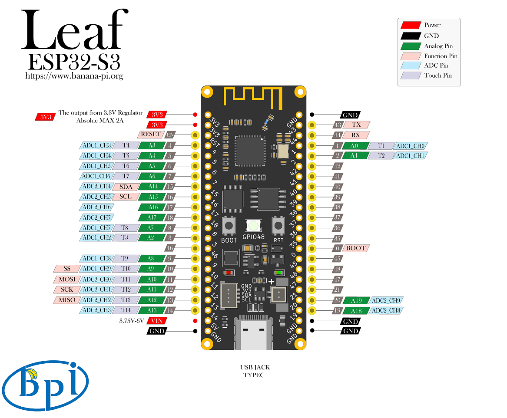

# 【 開發板介紹 】

BPI-Leaf-S3板載ESP32-S3芯片，支持 2.4 GHz Wi-Fi 和低功耗藍牙 (Bluetooth® LE) 雙模無線通信。板子支持USB和外接3.7V鋰電池兩種供電方式，可實現雙電源下自動切換電源功能，並支持USB充電方式。體積小巧，接口方便，上手簡單，可直接應用於物聯網低功耗項目。

BPI-Leaf-S3開發板在軟件方面支持ESP-IDF、Arduino、MicroPython等多種方式進行編程開發 。

BPI-Leaf-S3開發板上標記了與芯片對應的所有IO管腳，且IO管腳順序與Espressif ESP32-S3-DevKitC-1開發板一致，開發者可根據實際需求，可將DevKitC-1支持的外圍設備添加到BPI-Leaf-S3上，也可將開發板插在麵包板上使用。

## 關鍵特性

- ESP32-S3，Xtensa® 32 bit LX7
- 片上外設 PSRAM , FLASH
- Ultra-low power 10uA
- 2.4G WIFI ，Bluetooth 5 ，Bluetooth mesh
- GPIO , ADC , TOUCH , PWM , I2C , SPI , RMT , I2S , UART , LCD，CAMERA ，USB , JTAG
- 1 * 4pin I2C連接座
- 1 * USB Type-C
- 1 * 2pin 電池連接座，支持充電
- 1 * 全彩色LED

## 硬件

### 接口示意圖

### 硬件規格

<table>
   <tr>
      <td>BPI-Leaf-S3 規格表</td>
   </tr>
   <tr>
      <td>SoC主控芯片</td>
      <td>ESP32-S3，Xtensa® 32 位 LX7 雙核處理器</td>
   </tr>
   <tr>
      <td>主頻</td>
      <td>240MHz MAX</td>
   </tr>
   <tr>
      <td>工作溫度</td>
      <td>-40℃~+85℃</td>
   </tr>
   <tr>
      <td>片上 ROM</td>
      <td>384 KB</td>
   </tr>
   <tr>
      <td>片上 SRAM</td>
      <td>320 KB</td>
   </tr>
   <tr>
      <td>片外 FLASH ROM</td>
      <td>8MB</td>
   </tr>
   <tr>
      <td>片上外設 PSRAM</td>
      <td>2MB</td>
   </tr>
   <tr>
      <td>WIFI</td>
      <td>IEEE 802.11 b/g/n ，2.4Ghz頻帶，150Mbps</td>
   </tr>
   <tr>
      <td>藍牙</td>
      <td>Bluetooth 5 ，Bluetooth mesh</td>
   </tr>
   <tr>
      <td>GPIO</td>
      <td>BPI-Leaf-S3已引出36個可用GPIO</td>
   </tr>
   <tr>
      <td>ADC</td>
      <td>2 × 12 位 SAR ADC，支持 20 個模擬通道輸入</td>
   </tr>
   <tr>
      <td>TOUCH 電容式觸摸傳感器</td>
      <td>14</td>
   </tr>
   <tr>
      <td>SPI</td>
      <td>4</td>
   </tr>
   <tr>
      <td>I2C</td>
      <td>2，支持主機或從機模式</td>
   </tr>
   <tr>
      <td>I2S</td>
      <td>2，串行立體聲數據的輸入輸出</td>
   </tr>
   <tr>
      <td>LCD</td>
      <td>1，支持 8 位 ~16 位並行 RGB、I8080、MOTO6800 接口</td>
   </tr>
   <tr>
      <td>CAMERA</td>
      <td>1，支持 8 位 ~16 位 DVP 圖像傳感器接口</td>
   </tr>
   <tr>
      <td>UART</td>
      <td>3 ，支持異步通信（RS232 和RS485）和 IrDA</td>
   </tr>
   <tr>
      <td>PWM</td>
      <td>8 路獨立通道，14位精度</td>
   </tr>
   <tr>
      <td>MCPWM</td>
      <td>2</td>
   </tr>
   <tr>
      <td>USB</td>
      <td>1 × 全速USB 2.0 OTG，Type-C母口</td>
   </tr>
   <tr>
      <td>USB Serial/JTAG 控制器</td>
      <td>1，USB 全速標準，CDC-ACM ，JTAG</td>
   </tr>
   <tr>
      <td>溫度傳感器</td>
      <td>1，測量範圍為–20 °C 到 110 °C，用於監測芯片內部溫度</td>
   </tr>
   <tr>
      <td>SD/MMC</td>
      <td>1 × SDIO主機接口，具有2個卡槽，支持SD卡3.0和3.01，SDIO 3.0，CE-ATA 1.1，MMC 4.41，eMMC 4.5和4.51</td>
   </tr>
   <tr>
      <td>TWAI® 控制器</td>
      <td>1 ，兼容 ISO11898-1（CAN 規範 2.0）</td>
   </tr>
   <tr>
      <td>通用 DMA 控制器</td>
      <td>5 個接收通道和 5 個發送通道</td>
   </tr>
   <tr>
      <td>RMT</td>
      <td>4 通道發射，4通道接收，共享 384 x 32-bit 的 RAM</td>
   </tr>
   <tr>
      <td>脈衝計數器</td>
      <td>4個脈衝計數控制器（單元），每個單元有2個獨立的通道</td>
   </tr>
   <tr>
      <td>定時器</td>
      <td>4 × 54 位通用定時器，16 位時鐘預分頻器，1 × 52 位系統定時器，3 × 看門狗定時器</td>
   </tr>
   <tr>
      <td>外部晶振</td>
      <td>40Mhz</td>
   </tr>
   <tr>
      <td>RTC 和低功耗管理</td>
      <td>電源管理單元 (PMU)+ 超低功耗協處理器 (ULP)</td>
   </tr>
   <tr>
      <td>低功耗電流</td>
      <td>10uA</td>
   </tr>
   <tr>
      <td>工作電壓</td>
      <td>3.3V</td>
   </tr>
   <tr>
      <td>輸入電壓</td>
      <td>3.3V~5.5V</td>
   </tr>
   <tr>
      <td>最大放電電流</td>
      <td>2A@3.3V DC/DC</td>
   </tr>
   <tr>
      <td>USB充電</td>
      <td>支持</td>
   </tr>
   <tr>
      <td>最大充電電流</td>
      <td>500mA</td>
   </tr>
   <tr>
      <td>可控全彩色LED</td>
      <td>1</td>
   </tr>
</table>

### 硬件尺寸

<table>
   <tr>
      <td>BPI-Leaf-S3 尺寸表</td>
   </tr>
   <tr>
      <td>管腳間距</td>
      <td>2.54mm</td>
   </tr>
   <tr>
      <td>安裝孔間距</td>
      <td>23mm/ 62.25mm</td>
   </tr>
   <tr>
      <td>安裝孔尺寸</td>
      <td>內徑2mm/外徑3mm</td>
   </tr>
   <tr>
      <td>主板尺寸</td>
      <td>26 × 65.25(mm)/1.02 x 2.57(inches)</td>
   </tr>
   <tr>
      <td>板厚</td>
      <td>1.2mm</td>
   </tr>
   <tr>
      <td></td>
   </tr>
</table>

管腳間距兼容萬能板（洞洞板、點陣板），麵包板，便於調試應用。

## 資料與資源

- [GitHub: BPI-Leaf-S3 開發板原理圖PDF](https://github.com/BPI-STEAM/BPI-Leaf-S3-Doc/blob/main/sch/BPI-Leaf-S3-Chip-V0.1A.pdf) 

- [ESP32-S3 技術規格書](https://www.espressif.com/sites/default/files/documentation/esp32-s3_datasheet_cn.pdf)

- [ESP32-S3 技術參考手冊](https://www.espressif.com/sites/default/files/documentation/esp32-s3_technical_reference_manual_cn.pdf)