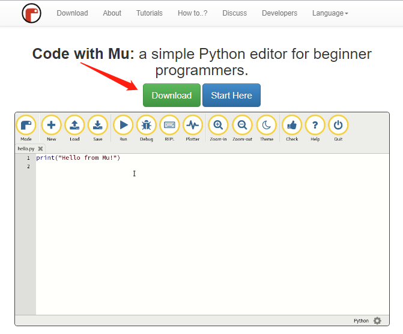
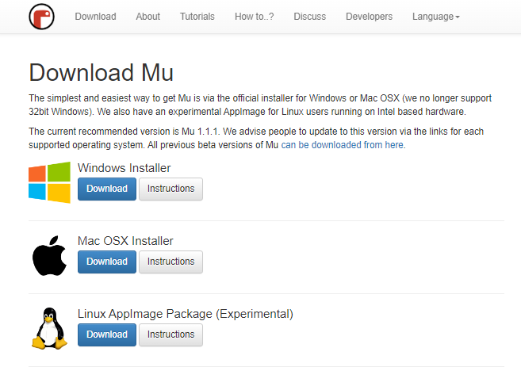
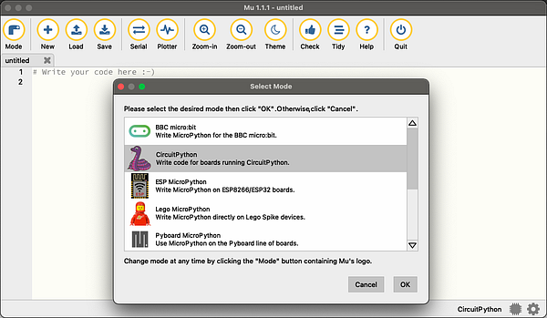
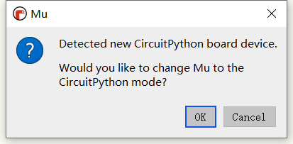

# Configure usage environment (Mu editor)

## Download and install Mu editor

1. Enter [**Mu Editing Organ Network**](https://codewith.mu/), click the **Download** button to enter the new page.

2. Select the operating system currently used by your computer, and click the **Download** button corresponding to the operating system to start downloading the installation package.

3. Click the **Instuctions** button corresponding to the operating system to view the detailed installation steps, and install according to the guidelines.

## Establish the connection between the Mu editor and the development board

> BPI-PicoW-S3 has been installed with tinyUF2 and CircuitPython firmware.

1. Start the Mu editor and change the mode to CircuitPython. If you have connected the CircuitPython development board correctly, you will be prompted whether to switch to this mode directly.

2. Click the **Serial** button, then press any key to enter the CircuitPython REPL.
