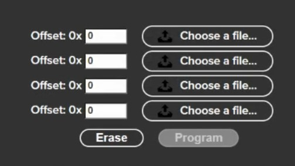

# How to upload tinyUF2 firmware
> All operations on flash are irreversible, pay attention to back up important files such as codes in advance.
## Download tinyUF2 firmware
1. Enter the [BPI-PicoW-S3 CircuitPython Download](https://circuitpython.org/board/bpi_picow_s3/) page.
2. Find the `Install, Repair, or Update UF2 Bootloader` column at the bottom of the page, and click the `DOWNLOAD BOOTLOADER ZIP` button at the bottom to download the compressed package.
3. Decompress the compressed package locally, the `combined.bin` file is the firmware we need.
## Put the board in bootloader mode

1. Connect the development board to the computer via USB.
2. Use any conductor such as a metal pin or tweezers to short the BOOT0 contacts to put the EPS32S3 chip in bootloader mode.
3. Press the `Reset` button once.
4. Release the BOOT0 contact.
## Burn the firmware in the browser
> Support Chrome, Edge browser, the kernel version must be higher than 89.
1. Open the [ESP Web Flasher](https://nabucasa.github.io/esp-web-flasher/) page.
2. Click the `Connect` button, an option bar will pop up, select the serial port where the development board is located.
     
     
3. After normal connection, click the `Erase` button to erase the flash contents of the development board, this process is irreversible.
    
4. Click the `Choose a file...` button, jump to the directory where the `combined.bin` file is located in the pop-up file selection window, select this file and click OK.
5. Click the `Program` button to start burning the firmware, wait for about five minutes to complete.
6. After finishing, manually press the `Reset` button once, and the symbol of successful programming is that the colorful light is always green. If you do not get this result, you can try the first five steps again, or try the next programming method.

## esptool local burning firmware

1. Open the [Python official website](https://www.python.org/).

     For the Windows system, the most convenient way to download the installation package is to click the icon shown in the figure below on the homepage of the official website to download.

     

     Other operating systems or other distributions can be selected in the Downloads option bar.

     It is recommended to use a version above python 3.7.

2. Be sure to check Add Python 3.x to PATH when starting the installation, so that you can avoid adding it to PATH manually.

     

     Follow the installation prompts step by step to complete the installation smoothly.

3. Taking the specific operation steps of Windows PowerShell as an example, use the following command to install esptool:

    ```shell
    pip install esptool
    ```

     If necessary in the future, you can use the following command to upgrade esptool:

    ```shell
    pip install -U esptool
    ```

4. Use commands or other methods to enter the directory where the firmware is located in PowerShell.

5. You can open the PowerShell window in this folder by holding down the shift key and right-clicking in the Windows folder window.

6. At this point, you need to set the development board to bootloader mode, see above for details.

7. Use the following command to clear the flash, you need to modify the COM interface to the corresponding interface, here is COM22.

    ```shell
    python -m esptool --chip esp32s3 --port COM22 --baud 460800 erase_flash
    ```

8. Use the following command to burn `combined.bin` firmware, you need to modify the COM interface to the corresponding interface, here is COM22.

    ```shell
    python -m esptool --chip esp32s3 --port COM22 --baud 460800 write_flash -z 0x0 combined.bin
    ```

9. After finishing, manually press the `Reset` button once, the sign of successful programming is that the colorful light is a constant green light, if you do not get this result, you can retry the first two steps of the command.