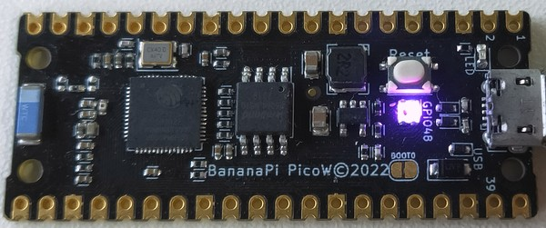

# How to update CircuitPython firmware
> TinyUF2 + CircuitPython firmware has been installed before leaving the factory. To upgrade circuitython, you only need to double-click the reset button to enter UF2 bootloader mode without erasing the flash.
> This method is applicable to development boards that already have tinyUF2 firmware. If the flash of the development board is erased or fails to enter UF2 mode, please refer to [How to burn tinyUF2 firmware](flash_tinyuf2.md).
1. Enter the [BPI-PicoW-S3 CircuitPython Download](https://circuitpython.org/board/bpi_picow_s3/) page.
    
2. Click the DOWNLOAD UF2 NOW button to download the latest released `.uf2` firmware.
3. Connect the development board to the computer via USB, and a disk named `CIRCUITPY` will appear on the computer file management page. This is a disk in CircuitPython mode. Double-click the `Reset` button on the development board to make it To change to a disk in UF2 mode, the following are the specific steps.
    1. Quickly press the `Reset` button once.
     
    2. Quickly press the `Reset` button again when the purple light is on.
     
    3. The sign of a successful trigger is that the colored light turns red after a while and turns green. If you do not get this result, you can try the first two steps again.
     
4. The name of the disk in UF2 mode is `UF2BOOT`, copy the `.uf2` firmware downloaded in step 1 to this disk, the colored light will flash orange during the process, please do not disconnect or modify the development board for any operation.
5. After the CircuitPython firmware update is completed, it will automatically reset, and a `CIRCUITPY` disk will reappear on the computer file management page, and the specific firmware version can be viewed through the REPL.