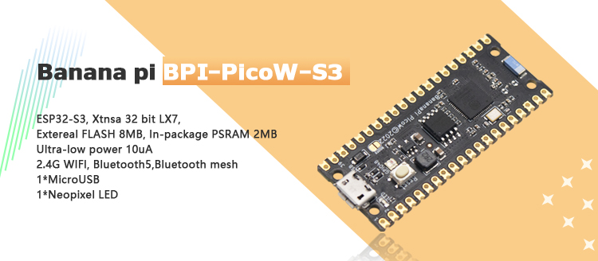

# 【 BPI-PicoW-S3 Development Board 】

## Introduction

The Banana Pi BPI-PicoW is equipped with a low-power microcontroller, a development board designed for IoT development and Maker DIY projects. The size is same as the Raspberry Pi Pico board, supports 2.4 GHz Wi-Fi and Bluetooth® LE dual-mode wireless communication, peripherals are compatible with its low-power hardware design, and consumes only 10uA in deep sleep mode. In terms of programming, PicoW-S3 supports ESP-IDF, Arduino, micropython, CircuitPython and other mainstream platforms.

## Programming with CircuitPython

> BPI-PicoW-S3 is pre-installed with tinyUF2 and CircuitPython firmware out of box. It is recommended to use CircuitPython to quickly get started with the BPI-PicoW-S3 development board as it is considered to be the most beginners friendly platform.

CircuitPython is a programming language designed to simplify programming experiments and learning on microcontroller development boards.

CircuitPython programming with the Mu editor is the least difficult way to get started. Install the software and connect the board to PC for the very first project.

## Programming with MicroPython

Regardless of the programmer is a beginner or not, MicroPython is considered to be less difficult to develop than other MCU programming languages.

Its code is easy to understand compared to other programming languages, and it has various resources accumulated over the years by the open source community.

Just like Python, it has strong community and application value.

By uploading the MicroPython firmware, you can use the Python programming language to program on the development board.

## Programming with Arduino

Provides software tools and best examples to get started with Arduino, lowering the barriers to entry into professional ESP32 embedded development.

>Arduino does not provide much of the beginners' content, basic knowledge of C/C++ programming is required in order to operate.

## Information and resources

- [Official WIKI](https://wiki.banana-pi.org/BPI-PicoW-S3_%E5%BC%80%E5%8F%91%E6%9D%BF)

- [GitHub: BPI-PicoW-S3 development board schematic PDF](https://github.com/BPI-STEAM/BPI-PicoW-Doc/blob/main/sch/BPI-PicoW-V0.4.pdf)

- [ESP32-S3 Datasheet](https://www.espressif.com/sites/default/files/documentation/esp32-s3_datasheet_cn.pdf)

- [ESP32-S3 Technical Reference Manual](https://www.espressif.com/sites/default/files/documentation/esp32-s3_technical_reference_manual_cn.pdf)

## Sample purchase

- [Official AliExpress](https://www.aliexpress.com/item/1005004775634442.html?spm=5261.ProductManageOnline.0.0.15744edfAyCaNk)

- [Official Taobao](https://item.taobao.com/item.htm?spm=a2126o.success.0.0.25b04831CHV1Nc&id=684134360199)

- OEM&OEM customized service: sales@banana-pi.com
