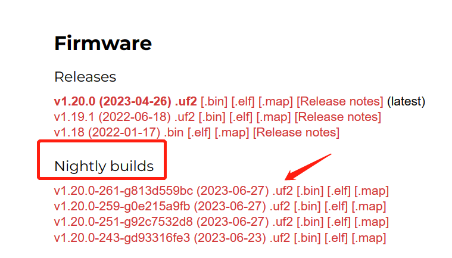
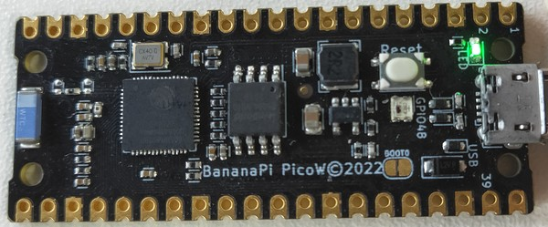
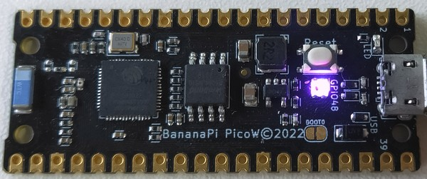
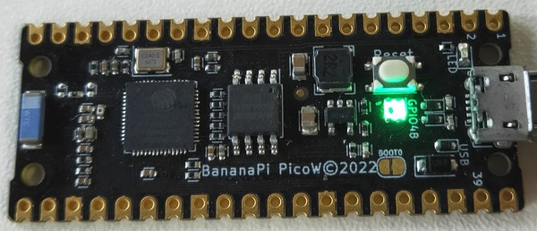

## 通过UF2安装MicroPython固件

> 出厂已安装 tinyUF2 + CircuitPython固件，安装micropython UF2固件 仅需双击复位键进入UF2 bootloader模式，无需擦除flash。
> 本方法适用于已具备tinyUF2固件的开发板，如果开发板的flash被擦除或出现无法进入UF2 bootloader模式的故障，则需先参考[烧录tinyUF2固件的方法](../CircuitPython/flash_tinyuf2.md)。

1. 点击此链接：[ESP32S3 micropython固件下载地址](https://micropython.org/download/ESP32_GENERIC_S3/)。
2. 找到下方 Firmware > Nightly builds，下载第一项，最新的，后缀名为 `.uf2`的固件。
    
3. 使用一根具有供电与数据功能的microUSB线连接开发板与你的计算机。在文件管理页面将出现一个名为`CIRCUITPY`的磁盘，此为CircuitPython模式下的磁盘，通过双击开发板上的`Reset`按键的方式，使其变更为UF2模式下的磁盘，以下为具体操作步骤。
   1. 快速按一次`Reset`按键。
    
   2. 紫灯亮起时再快速按一次`Reset`按键。
    
   3. 成功触发的标志是彩灯在片刻红灯后转变为长绿灯，如果没有得到此结果，可以重试前两步。
    
4. UF2模式下的磁盘名称为`UF2BOOT`，将第1步下载的`.uf2`固件复制到此磁盘中，过程中彩灯会闪烁橙灯，请勿在此过程中断开连接或对开发板进行任何操作。
5. 完成MicroPython固件拷贝后会自动复位，在文件管理页面将不会出现任何新磁盘，MicroPython不提供类似功能，可通过thonny或mpremote来进行开发。

## 在MicroPython中格式化分区的方法

因为BPI-PicoW-S3开发板出厂使用CircuitPython固件，切换为MicroPython固件后，文件分区内会残留旧文件，还需手动格式化清除文件。

另外，micropython.uf2固件在tinyUF2 bootloader中，用户分区只能使用FAT格式，可能偶尔会发生一些文件错误，目前最简单的除错办法是手动格式化分区。

请在连接上MicroPython REPL后，依次输入以下命令：

```py
os.umount("/")
os.VfsFat.mkfs(bdev)
vfs = os.VfsFat(bdev)
os.mount(vfs, "/")
```

