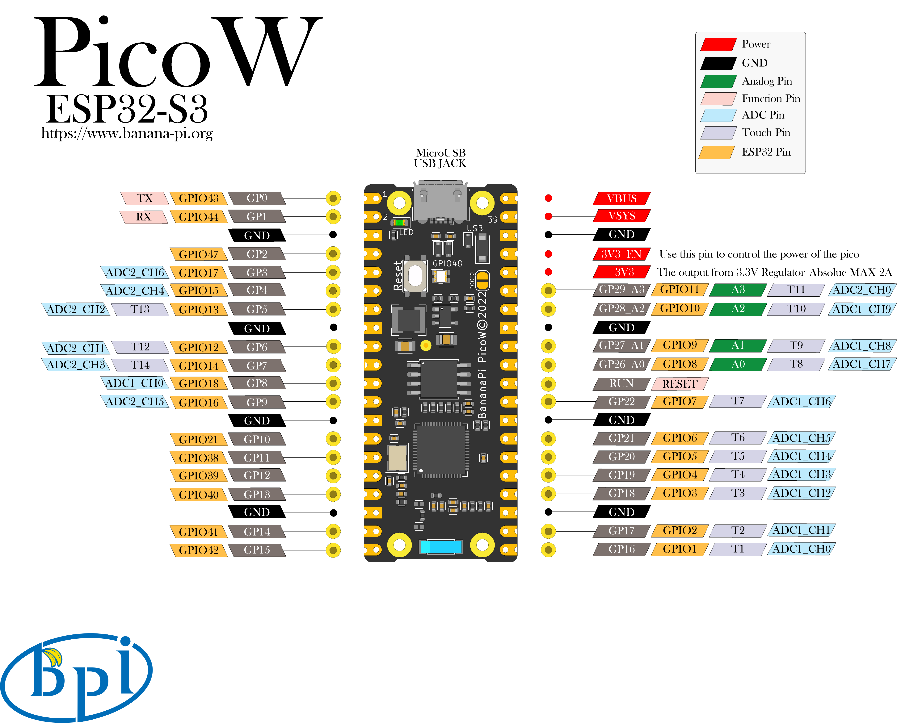
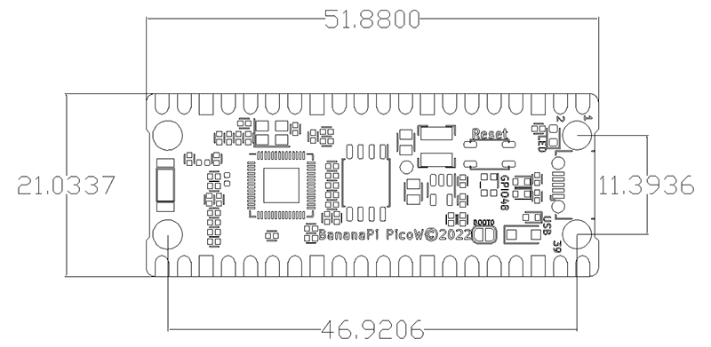

# 【 开发板介绍 】

BPI-PicoW-S3板载ESP32-S3芯片，支持 2.4 GHz Wi-Fi 和低功耗蓝牙 (Bluetooth® LE) 双模无线通信。板子支持USB和IO供电两种供电方式，可实现双电源下自动切换电源功能。体积小巧，接口方便，上手简单，可直接应用于物联网低功耗项目。

BPI-PicoW-S3开发板在软件方面支持ESP-IDF、Arduino、MicroPython等多种方式进行编程开发 。

BPI-PicoW-S3开发板上标记了与芯片对应的所有IO管脚，外形与Raspberry Pico W开发板一致，开发者可根据实际需求，可将Raspberry Pico W支持的外围设备添加到BPI-PicoW-S3上，也可将开发板插在面包板上使用。

## 关键特性

- ESP32-S3，Xtensa® 32 bit LX7
- 片上外设 PSRAM , 片外 FLASH
- Ultra-low power 10uA
- 2.4G WIFI ，Bluetooth 5 ，Bluetooth mesh
- GPIO , ADC , TOUCH , PWM , I2C , SPI , RMT , I2S , UART , LCD，CAMERA ，USB , JTAG
- 1 * MicroUSB
- 1 * 全彩色LED

## 硬件

### 接口示意图

### 硬件规格

<table>
   <tr>
      <td>BPI-PicoW-S3 规格表</td>
   </tr>
   <tr>
      <td>SoC主控芯片</td>
      <td>ESP32-S3，Xtensa® 32 位 LX7 双核处理器</td>
   </tr>
   <tr>
      <td>主频</td>
      <td>240MHz MAX</td>
   </tr>
   <tr>
      <td>工作温度</td>
      <td>-40℃~+85℃</td>
   </tr>
   <tr>
      <td>片上 ROM</td>
      <td>384 KB</td>
   </tr>
   <tr>
      <td>片上 SRAM</td>
      <td>320 KB</td>
   </tr>
   <tr>
      <td>片外 FLASH ROM</td>
      <td>8MB</td>
   </tr>
   <tr>
      <td>片上外设 PSRAM</td>
      <td>2MB</td>
   </tr>
   <tr>
      <td>WIFI</td>
      <td>IEEE 802.11 b/g/n ，2.4Ghz频带，150Mbps</td>
   </tr>
   <tr>
      <td>蓝牙</td>
      <td>Bluetooth 5 ，Bluetooth mesh</td>
   </tr>
   <tr>
      <td>GPIO</td>
      <td>BPI-PicoW-S3已引出27个可用GPIO</td>
   </tr>
   <tr>
      <td>ADC</td>
      <td>2 × 12 位 SAR ADC，支持 20 个模拟通道输入</td>
   </tr>
   <tr>
      <td>TOUCH 电容式触摸传感器</td>
      <td>14</td>
   </tr>
   <tr>
      <td>SPI</td>
      <td>4</td>
   </tr>
   <tr>
      <td>I2C</td>
      <td>2，支持主机或从机模式</td>
   </tr>
   <tr>
      <td>I2S</td>
      <td>2，串行立体声数据的输入输出</td>
   </tr>
   <tr>
      <td>LCD</td>
      <td>1，支持 8 位 ~16 位并行 RGB、I8080、MOTO6800 接口</td>
   </tr>
   <tr>
      <td>CAMERA</td>
      <td>1，支持 8 位 ~16 位 DVP 图像传感器接口</td>
   </tr>
   <tr>
      <td>UART</td>
      <td>3 ，支持异步通信（RS232 和RS485）和 IrDA</td>
   </tr>
   <tr>
      <td>PWM</td>
      <td>8 路独立通道，14位精度</td>
   </tr>
   <tr>
      <td>MCPWM</td>
      <td>2</td>
   </tr>
   <tr>
      <td>USB</td>
      <td>1 × 全速USB 2.0 OTG，MicroUSB母口</td>
   </tr>
   <tr>
      <td>USB Serial/JTAG 控制器</td>
      <td>1，USB 全速标准，CDC-ACM ，JTAG</td>
   </tr>
   <tr>
      <td>温度传感器</td>
      <td>1，测量范围为–20 °C 到 110 °C，用于监测芯片内部温度</td>
   </tr>
   <tr>
      <td>SD/MMC</td>
      <td>1 × SDIO主机接口，具有2个卡槽，支持SD卡3.0和3.01，SDIO 3.0，CE-ATA 1.1，MMC 4.41，eMMC 4.5和4.51</td>
   </tr>
   <tr>
      <td>TWAI® 控制器</td>
      <td>1 ，兼容 ISO11898-1（CAN 规范 2.0）</td>
   </tr>
   <tr>
      <td>通用 DMA 控制器</td>
      <td>5 个接收通道和 5 个发送通道</td>
   </tr>
   <tr>
      <td>RMT</td>
      <td>4 通道发射，4通道接收，共享 384 x 32-bit 的 RAM</td>
   </tr>
   <tr>
      <td>脉冲计数器</td>
      <td>4个脉冲计数控制器（单元），每个单元有2个独立的通道</td>
   </tr>
   <tr>
      <td>定时器</td>
      <td>4 × 54 位通用定时器，16 位时钟预分频器，1 × 52 位系统定时器，3 × 看门狗定时器</td>
   </tr>
   <tr>
      <td>外部晶振</td>
      <td>40Mhz</td>
   </tr>
   <tr>
      <td>RTC 和低功耗管理</td>
      <td>电源管理单元 (PMU)+ 超低功耗协处理器 (ULP)</td>
   </tr>
   <tr>
      <td>低功耗电流</td>
      <td>10uA</td>
   </tr>
   <tr>
      <td>工作电压</td>
      <td>3.3V</td>
   </tr>
   <tr>
      <td>输入电压</td>
      <td>3.3V~5.5V</td>
   </tr>
   <tr>
      <td>最大放电电流</td>
      <td>2A@3.3V DC/DC</td>
   </tr>
   <tr>
      <td>可控全彩色LED</td>
      <td>1</td>
   </tr>
</table>

### 硬件尺寸

<table>
   <tr>
      <td>BPI-PicoW-S3 尺寸表</td>
   </tr>
   <tr>
      <td>管脚间距</td>
      <td>2.54mm</td>
   </tr>
   <tr>
      <td>安装孔间距</td>
      <td>11.4mm/ 47mm</td>
   </tr>
   <tr>
      <td>安装孔尺寸</td>
      <td>内径2.1mm/外径3.4mm</td>
   </tr>
   <tr>
      <td>主板尺寸</td>
      <td>21 × 51.88(mm)/0.83 x 2.04(inches)</td>
   </tr>
   <tr>
      <td>板厚</td>
      <td>1.2mm</td>
   </tr>
   <tr>
      <td></td>
   </tr>
</table>

管脚间距兼容万能板（洞洞板、点阵板），面包板，并且能直接贴在其他PCB上，便于调试应用。

## 资料与资源

- [GitHub: BPI-PicoW-S3 开发板原理图PDF](https://github.com/BPI-STEAM/BPI-PicoW-Doc/blob/main/sch/BPI-PicoW-V0.4.pdf) 

- [ESP32-S3 技术规格书](https://www.espressif.com/sites/default/files/documentation/esp32-s3_datasheet_cn.pdf)

- [ESP32-S3 技术参考手册](https://www.espressif.com/sites/default/files/documentation/esp32-s3_technical_reference_manual_cn.pdf)