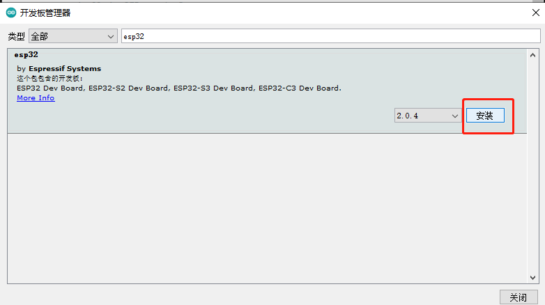

# 環境搭建

由於板子的大小，PicoW-S3 的 Arduino 使用會比較複雜，我們不建議您使用 PicoW-S3 來學習 Arduino。本文將指導您為 PicoW-S3 安裝 Arduino 支持。


> 參考 [arduino-esp32 DOC 入門 » 安裝](https://docs.espressif.com/projects/arduino-esp32/en/latest/installing.html)

## 使用 Arduino IDE 安裝支持

以下是直接從 Arduino IDE 安裝 Arduino-ESP32 的方法。

> 從 Arduino IDE 版本 1.6.4 開始，Arduino 允許使用 Boards Manager 安裝第三方平台包。有適用於 Windows、macOS 和 Linux 的軟件包。

Arduino IDE下載地址：https://www.arduino.cc/en/software

> Arduino IDE 2.0 的 UI 與 Arduino IDE 1.8.x 的 UI 略有不同。本文基於1.8.13版本，但不影響使用2.0版本的用戶參考。

要使用 Boards Managaer 安裝 esp32 平台包，請執行以下步驟：

- 安裝當前的上游 Arduino IDE 1.8 或更高版本。

- 啟動 Arduino 並打開 File > Preferences 窗口並找到 Additional Board Manager URL。


- 穩定版鏈接：
````
https://raw.githubusercontent.com/espressif/arduino-esp32/gh-pages/package_esp32_index.json
````
- 開發版鏈接：
````
https://raw.githubusercontent.com/espressif/arduino-esp32/gh-pages/package_esp32_dev_index.json
````
- 在其他董事會經理 URL 之後輸入上述發布鏈接之一。您可以添加多個 URL，每行一個。


從菜單中打開 Tools > Board > Board Manager 搜索並安裝 esp32 平台。



重啟arduino IDE後，可以看到開發板選項裡面多了ESP32 Arduino選項。

選擇型號`ESP32S3 Dev Module`，然後按照下圖所示內容進行配置。不能使用不正確的配置。請務必按照下圖所示內容進行配置！

