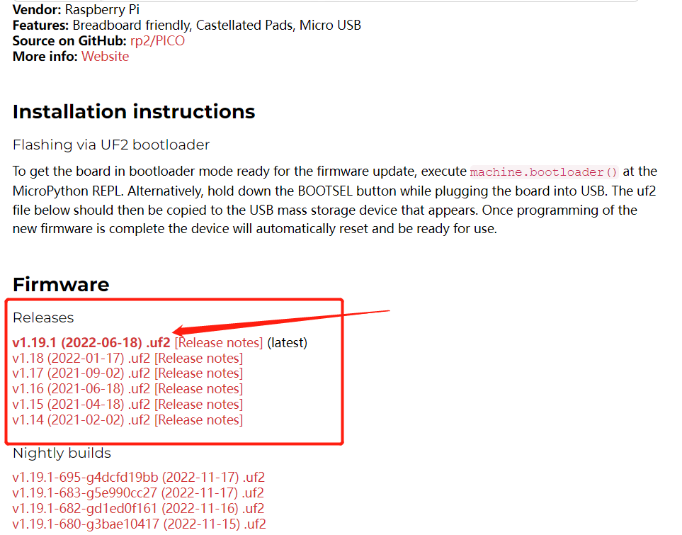

# MicroPython 固件下载与烧录

在[MicroPython官网](https://micropython.org/)可以找到支持RP2040芯片的固件，BPI-Pico-RP2040完全兼容Raspberry Pi Pico的固件: https://micropython.org/download/rp2-pico/

点击连接进入页面后即可在下方看到几列固件下载地址，推荐选择下载Releases栏的第一项，兼顾稳定性与新功能特性，后续例程基于v1.19.1固件编写。



Nightly builds 栏所提供的固件为每日构建，将拥有最新的功能特性，但稳定性可能稍差，且可能尚没有对应最新功能的使用文档。

下载完成后将得到一个 .uf2 扩展名的文件，将其烧录到BPI-Pico-RP2040开发板的方式非常简单，先确保有一根type-c数据线，一端连接到PC，拿起开发板，保持上面无任何连线或外围硬件，按住Boot按钮，将type-c数据线与开发板连接，松开Boot按钮，PC的系统中将出现一个名为RPI-RP2的新磁盘，将.uf2文件复制到此盘中，复制完成后开发板将自动复位，进入 MicroPython 模式。

## 安装Python环境

打开[Python官网](https://www.python.org/) 。

对于Windows 系统来说，最便捷的安装包下载方法就是在官网首页点击如下图所示的图标进行下载。


其他操作系统或是其他发行版本则可以在 Downloads 选项栏中进行选择。

建议使用python 3.7以上的版本。

开始安装时一定要记得勾选Add Python 3.x to PATH，这样可以免除再手动添加进PATH。


按照安装提示逐步操作即可顺利完成安装 。

## 安装Thonny IDE

以Windows PowerShell的具体操作步骤为例。

其他系统或安装方法可参考[Thonny官网](https://thonny.org/)上的说明。

右键Windows开始菜单即可看到Windows PowerShell ，单击打开。


我们在此处通过pip来安装Thonny IDE。

pip是 Python 包管理工具，首先要确认pip是否是最新版，直接使用以下命令升级pip：

```shell
pip install -U pip
```

使用以下命令安装Thonny：

```shell
pip install thonnyapp
```

如果未来有需要，则可以使用以下命令升级Thonny：

```shell
pip install -U thonnyapp
```

用Windows搜索即可快速找到Thonny，也可以在开始菜单栏里找到它。


# Hello World

我们可以从输出一段“Hello World”文字开始，以此作为了解和学习MicroPython的第一步。

> 本文所述操作基于Thonny IDE，需要先完成对Thonny IDE的配置，与开发板建立连接。[Thonny IDE运行环境搭建可以参考这里](../Programming/Environment.md)。

## 使用REPL

**REPL**即**Read-Eval-Print-Loop**的缩写名词，译为 **读取-求值-输出-循环**。

我们可以通过实际操作来明白它的意思。

将已经安装了MicroPython固件的开发板连接电脑，运行Thonny IDE并正确配置后，在Shell窗口中将出现这样的文本内容：

```
MicroPython v1.17 on 2022-01-09; ESP32S3 module with ESP32S3
Type "help()" for more information.
>>> 
```

注意最后一行的`>>>`提示符，我们可以直接在这后面输入算式或是代码，按下键盘`enter`回车键就会立即在下一行得到输出结果。

```python
>>> 1+2
3
>>> print("Hello World")
Hello World
>>> 
```

现在可以很直观的理解了，它会读取我们输入的信息，执行运算求值，输出结果，然后等待我们后续的输入，一直循环这个过程，这也是**REPL**又被译为**交互式解释器**的原因，我们可以直接通过输入代码来和硬件交互，没有像传统的C语言那样需要在中间执行编译的过程，我们输入的信息没有经过编译就传输给芯片自行解释并运行了，这本是Python语言的一大重要特性，MicroPython完美继承了它。

如果仅仅是使用MicroPython REPL，很多具有串口信息收发功能的软件都可以操作，感兴趣的话可以试试各种串口工具，这可以令人更深刻的理解 “没有中间执行编译的过程” 的意思。

>关于REPL的应用，更详尽全面的内容可以参考[MicroPython文档：REPL](https://docs.micropython.org/en/latest/reference/repl.html)

## 代码编辑器

Thonny IDE当然不仅仅可以进行REPL的操作，作为python代码编辑器，本职功能还是有的。

新建一个文件并在其编辑区内输入代码。

```python
print(1+2)
print("Hello World")
```

完成代码编辑后，点击**保存**，可以选择将文件保存到MicroPython设备中，这将直接将整个文件的数据传输到flash中。可将文件命名为`main.py`，设备会在每次上电或复位后执行有这个文件名的程序，而其他名称的文件仅在被`main.py`调用时或是我们在Thonny中点击**运行**时被执行。


现在点击**运行**，同样是无需编译的，在Shell中会立即得到结果。

```
3
Hello World
```

另外也可以尝试REPL的键盘控制快捷键**ctrl+D**软件复位，可以看到复位后程序立即执行并打印出信息。