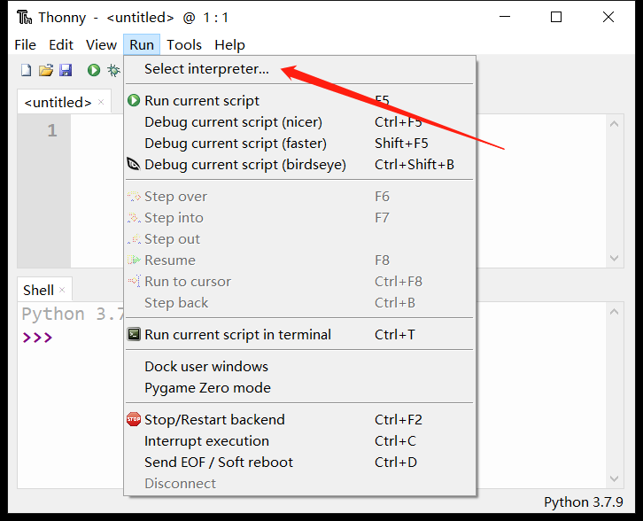

## MicroPython 固件下载与烧录

在[MicroPython官网](https://micropython.org/)可以找到支持RP2040芯片的固件，BPI-Pico-RP2040完全兼容Raspberry Pi Pico的固件: https://micropython.org/download/rp2-pico/

点击连接进入页面后即可在下方看到几列固件下载地址，推荐选择下载Releases栏的第一项，兼顾稳定性与新功能特性，后续例程基于v1.19.1固件编写。


Nightly builds 栏所提供的固件为每日构建，将拥有最新的功能特性，但稳定性可能稍差，且可能尚没有对应最新功能的使用文档。

下载完成后将得到一个 .uf2 扩展名的文件，将其烧录到BPI-Pico-RP2040开发板的方式非常简单，先确保有一根type-c数据线，一端连接到PC，拿起开发板，保持上面无任何连线或外围硬件，按住Boot按钮，将type-c数据线与开发板连接，松开Boot按钮，PC的系统中将出现一个名为RPI-RP2的新磁盘，将.uf2文件复制到此盘中，复制完成后开发板将自动复位，进入 MicroPython 模式。

## 安装Thonny IDE 

以Windows为例，点击连接下载 [thonny-3.3.13.zip](../assets/images/thonny-3.3.13.zip)，解压后得到`thonny-3.3.13.exe`。

运行`thonny-3.3.13.exe`，按照安装提示逐步操作即可顺利完成安装 。

也可通过pip安装，`pip install thonny==3.3.13`，需要具备[Python](https://www.python.org/)环境，适用于macOS或Linux。

## 建立开发板与Thonny的连接

连接开发板与电脑。

运行Thonny，点击 Run > Select interpreter 。


选择 MicroPython(Raspberry Pi Pico) 。


选择开发板所在的串行接口，点击OK确认设置。


勾选 View > Files 即可打开文件管理栏。


## 使用REPL输出Hello World

**REPL**即**Read-Eval-Print-Loop**的缩写名词，译为 **读取-求值-输出-循环**。

我们可以通过实际操作来明白它的意思。

将已经安装了MicroPython固件的开发板连接电脑，运行Thonny IDE并正确配置后，在Shell窗口中将出现这样的文本内容：

```
MicroPython v1.19.1 on 2022-06-18; Raspberry Pi Pico with RP2040
Type "help()" for more information.
>>> 
```

注意最后一行的`>>>`提示符，我们可以直接在这后面输入算式或是代码，按下键盘`enter`回车键就会立即在下一行得到输出结果。

```python
>>> 1+2
3
>>> print("Hello World")
Hello World
>>> 
```

现在可以很直观的理解了，它会读取我们输入的信息，执行运算求值，输出结果，然后等待我们后续的输入，一直循环这个过程，这也是**REPL**又被译为**交互式解释器**的原因，我们可以直接通过输入代码来和硬件交互，没有像传统的C语言那样需要在中间执行编译的过程，我们输入的信息没有经过编译就传输给芯片自行解释并运行了，这本就是Python语言的一大重要特性，MicroPython完美继承了它。

如果仅仅是使用MicroPython REPL，很多具有串口信息收发功能的软件都可以操作，感兴趣的话可以试试各种串口工具，这可以令人更深刻的理解 “没有中间执行编译的过程” 的意思。

>关于REPL的应用，更详尽全面的内容可以参考[MicroPython文档：REPL](https://docs.micropython.org/en/latest/reference/repl.html)

## 代码编辑器

Thonny IDE当然不仅仅可以进行REPL的操作，作为python代码编辑器，本职功能还是有的。

新建一个文件并在其编辑区内输入代码。

```python
print(1+2)
print("Hello World")
```

完成代码编辑后，点击 **Save**，可以选择将文件保存到开发板中，这将直接将整个文件传输到开发板的flash中。可将文件命名为`main.py`，设备会在每次上电或复位后执行它。


现在点击 **Run current script** 运行，同样是无需编译的，在Shell中会立即得到结果。

```
3
Hello World
```

另外也可以尝试REPL的键盘控制快捷键**ctrl+D**软件复位，可以看到复位后程序立即执行并打印出信息。

## 点亮LED

BPI-Pico-RP2040上的板载LED连接到GPIO 25引脚，你可以在REPL上点亮它。当你看到REPL提示`>>>`时，请输入以下代码。
```python
>>> from machine import Pin
>>> led = Pin(25, Pin.OUT)
```
> `machine`模块用于控制开发板上的硬件。这是所有MicroPython端口的标准配置，你可以在[MicroPython文档：machine](https://docs.micropython.org/en/v1.19.1/library/machine.html)中了解更多有关它的信息。

输入以下代码LED将亮起。
```python
>>> led.value(1)
```

输入以下代码将熄灭LED。
```python
>>> led.value(0)
```

## 使用板载彩灯

BPI-Pico-RP2040上的板载 WS2812 彩灯连接到GPIO 3引脚，它仅需一个信号线即可控制，在REPL中输入以下代码。
```python
>>> from machine import Pin
>>> from neopixel import NeoPixel
>>> neo = NeoPixel(Pin(3), 1)
```
> `neopixel`模块为 WS2812 彩灯提供驱动程序。你可以在[MicroPython文档：neopixel](https://docs.micropython.org/en/v1.19.1/library/neopixel.html)中了解更多有关它的信息。
输入以下代码，彩灯将亮起红色。
```python
>>> neo[0] = (25,0,0)
>>> neo.write()
```
`neo[0] = (25,0,0)`设定第一颗彩灯的颜色。

WS2812 彩灯内有三颗纯色LED，它们的颜色分别是红，绿，蓝，`(25,0,0)`元组中的元素依次对应控制它们的亮度，数值范围 0 ~ 255， 元素的数值越大，它所控制的纯色LED就越亮。
建议将元素的数值控制在50以下，数值过高时近距离直视会刺眼。

`neo.write()`执行后，芯片会将控制信号传输给这颗板载的 WS2812 彩灯。

你可以尝试自行修改元组中的数据，控制彩灯的颜色，例如继续在REPL中输入以下代码，使彩灯亮白色。
```python
>>> neo[0] = (25,25,25)
>>> neo.write()
```
