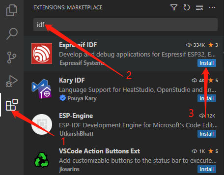
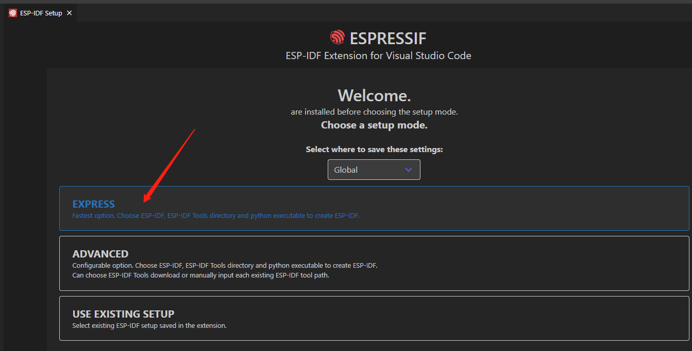
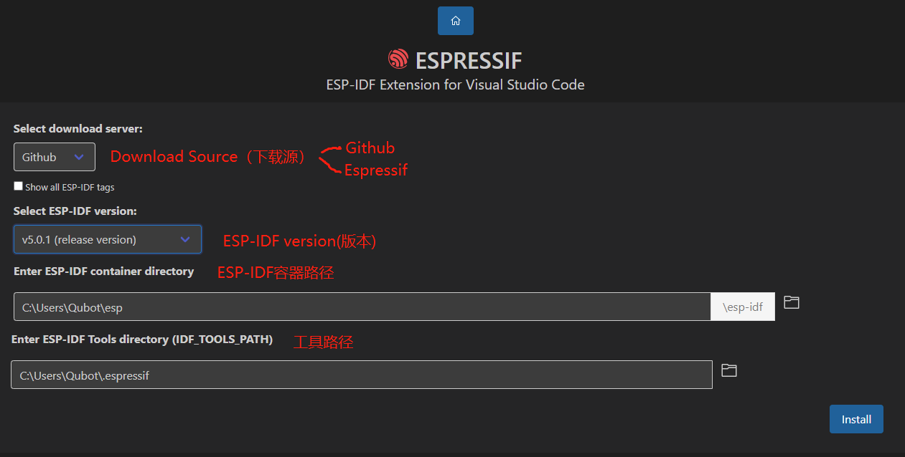
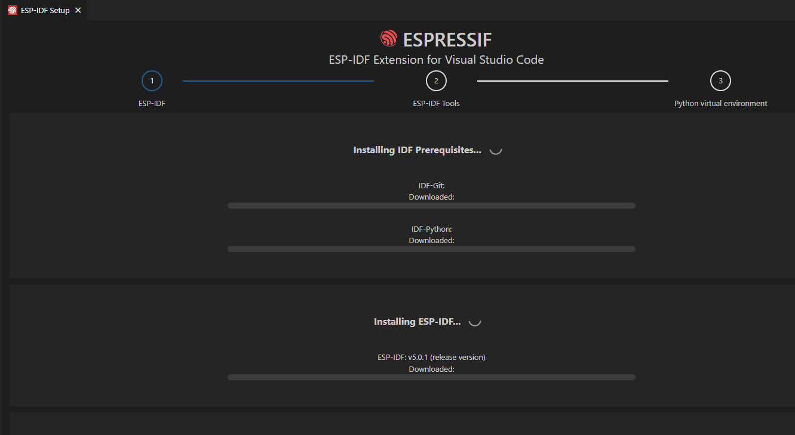
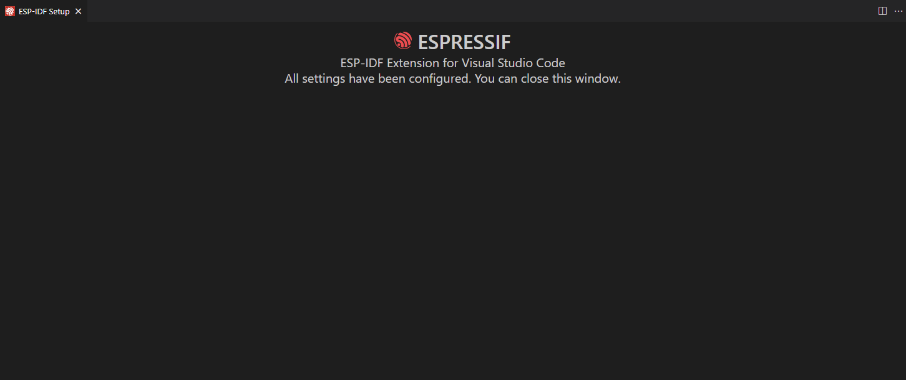

本系列旨在交流 ESP32-S3 硬件开发环境的搭建，通过一些基本的示例来展示怎么用 ESP-IDF (Espressif IoT Development Framework) 来安装、配置环境，并编译、下载固件至 ESP32-S3 开发板等步骤。如果有什么没提到或者有问题的，欢迎各位留言交流。

<!-- more -->

原文链接: https://qubot.org/2023/03/22/install-esp-idf-for-bananapi-bpi-leaf-s3/
作者：[Qubot](https://qubot.org) 

## 前言
ESP-IDF是一个面向ESP32系列的官方开发框架，用于开发嵌入式应用程序。目前ESP-IDF已经支持了很多芯片，下面是具体的型号。


最新的支持列表在[这里](https://github.com/espressif/esp-idf/blob/master/README_CN.md) 获取

## 安装前的准备

### 必备硬件
* BPI-Leaf-S3开发板：[购买链接](https://item.taobao.com/item.htm?id=677287234553)（其他板子也可以）

* USB 数据线 (USB-A 转 Type-C)

* 电脑（Windows、Linux 或 macOS都可以）

### 必备软件
在安装ESP-IDF之前，需要安装一些必要的软件：

* Git：用于从GitHub上克隆ESP-IDF存储库。

* Python：ESP-IDF需要Python 3.5或更高版本。

* CMake：用于生成构建文件。

#### Windows系统

在Windows系统中，可以从以下链接下载和安装这些软件：

Git: https://git-scm.com/download/win
Python: https://www.python.org/downloads/windows/
CMake: https://cmake.org/download/

#### Linux系统

在Linux系统中，可以使用以下命令来安装这些软件（Linux下我没有装过，这里是根据官方文档加上的）：

* Ubuntu 和 Debian:

```shell
sudo apt-get install git wget flex bison gperf python3 python3-venv python3-setuptools cmake ninja-build ccache libffi-dev libssl-dev dfu-util libusb-1.0-0
```


* CentOS 7 & 8（官方这里说为了好的体验建议用CentOS 8）:

```shell
sudo yum -y update && sudo yum install git wget flex bison gperf python3 python3-setuptools cmake ninja-build ccache dfu-util libusbx
```

* Arch:

```shell
sudo pacman -S --needed gcc git make flex bison gperf python cmake ninja ccache dfu-util libusb
```

#### MacOS系统

在MacOS中，需要先安装一个HomeBrew（MacPorts也行，不过没试过）

```shell
brew install cmake ninja dfu-util
```

或者（MacPorts下）

```shell
sudo port install cmake ninja dfu-util
```

如果你想加快编译速度，需要装一个ccache

```shell
brew install ccache
```

或者（MacPorts下）

```shell
sudo port install ccache
```

## 安装

我这里是基于VS Code的安装，所以首先需要再安装一个VS Code，下载地址：[Visual Studio Code](https://code.visualstudio.com/) 

安装完成之后，单击 Visual Studio Code 一侧活动栏中的扩展图标，打开扩展视图或者快捷键Ctrl+Shift+X，Mac下是⇧+⌘+X），并在搜索框内输入idf搜索，下面第一个就是，点击Install安装，并等待右下角加载完



点击右上角的View > Command Palette（或者Ctrl+Shift+P，Mac下是⇧+⌘+P），输入ESP-IDF: Configure（不分大小写）并选择第一个


接下来就是开始下载选择ESP-IDF安装在哪里，点击EXPRESS选择快速安装（或者如果你已经安装了 ESP-IDF，则使用现有设置，选择第三个）



这一步是选择下载源（Github还是Espressif），IDF的版本（这里我选择的是5.0.1），IDF容器的路径（这里是Docker安装？）以及IDF工具的路径，选好之后点Install



接下来等待安装完成就行了，如果你在国内，可能会遇到网络故障问题，需要你自备工具解决，如果没有的话就反复安装就行。（或者选择spressif源试试？这个我没试过）



安装结束之后，会如图显示All settings have been configured. You can close this window.

